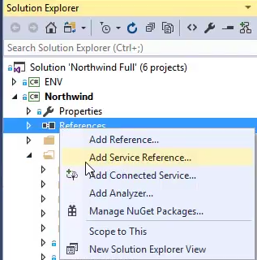
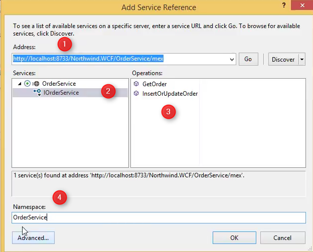

* In the Solution Explorer, on the Northwind Project
* Right Click on References and choose "Add Service Reference..."  

* You'll get the "Add Service Reference" Dialog
1. Paste the WebService URL in the Address TextBox
2. Select the Service you require
3. See the different methods of that Service
4. Choose the Namespace where all the classes related to this WebService will be stored  



* To use the WebService, Create a new instance of the XXXClient class (OrderServiceClient class in our case). Note that this class is in the `OrderService` namespace we've previously chose in the "Add Service Reference" dialog
* See that the `GetOrder` method of the client returns an object of type `OrderService.OrderPoco` that was automatically generated by Visual Studio as part of our Service Reference.   
We'll use that class to interact with the Service
```csdiff
public void Run()
{
+   var c = new OrderService.OrderServiceClient();
+   var o = c.GetOrder(10249);
}
```


<iframe width="560" height="315" src="https://www.youtube.com/embed/OsUUiSL6Dyk?list=PL1DEQjXG2xnIpyKeZmM66PL2bbuUyhyNE" frameborder="0" allowfullscreen></iframe>