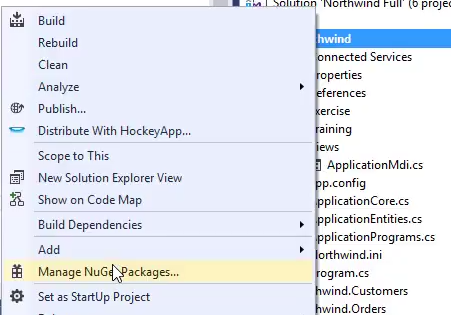
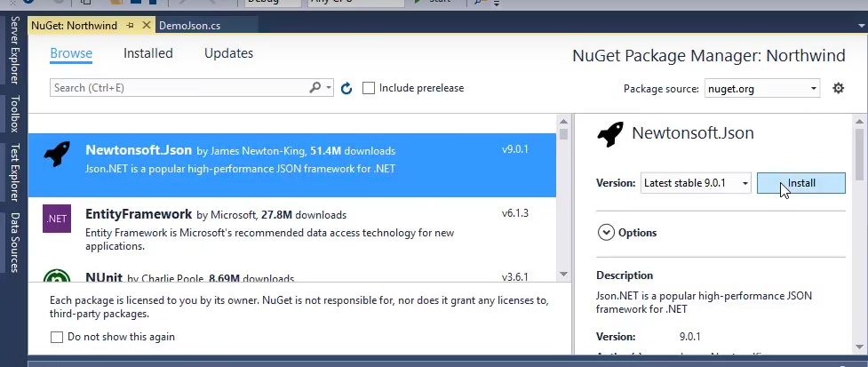

We'll use the "Newtonsoft.Json" library to read and write json data.

We'll download it and add it to our project using NuGet. (NuGet is an easy way to download, and reference a 3rd part component - it downloads it and takes care of all the basic configuration)

* Add a "NuGen Package" by right clicking on "Northwind" and choose "Manage NuGet Packages..."  
* 
* We'll search for "Newtonsoft.Json" and Install it  


* To use the previews Demo code we used for XML, we'll change the  `GetOrder` and `UpdateOrder` methods in the `Demo` class to `public static`
```csdiff
class Demo
{
+   public static OrderPoco GetOrderPoco(int orderId)
    {
        ...
    }
+   public static void UpdateOrder(OrderPoco o)
    {
        ...
    }
}
```
* Add `using Newtonsoft.Json;`
* Save Json data to string
```csdiff
var o = Demo.GetOrderPoco(10249);
+var s = JsonConvert.SerializeObject(o);
```
* Save the string to a file
```csdiff
var o = Demo.GetOrderPoco(10249);
var s = JsonConvert.SerializeObject(o);
+System.IO.File.WriteAllText(@"c:\temp\order.json", s);
```

<iframe width="560" height="315" src="https://www.youtube.com/embed/D9voLUegY74?list=PL1DEQjXG2xnIpyKeZmM66PL2bbuUyhyNE" frameborder="0" allowfullscreen></iframe>