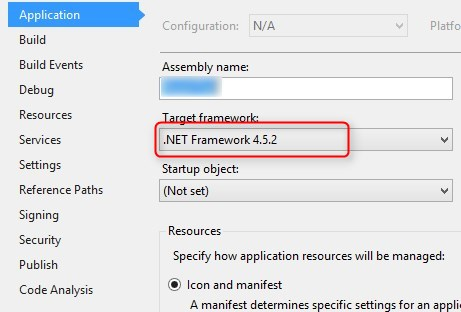
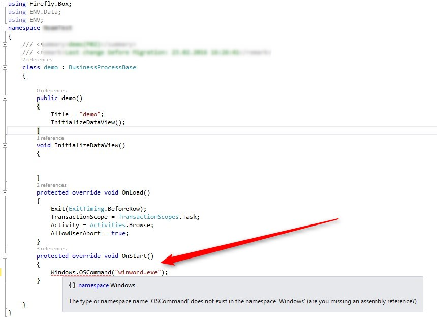

# Migrating to .Net framework 4.5.2 or higher

Microsoft has set the support end date of  .Net framework 4.5 and 4.5.1 to 12/01/2016, as you can see [here](https://support.microsoft.com/en-us/lifecycle?C2=548).

In most cases this does not present any problem, so you can continue using the existing version.

In case you decide to upgrade the version, all you need to do is make sure the .Net framework version you are using is higher than 4.5.1 in the project properties:  

  

In the new version Microsoft added a new namespace named “Windows”.  
This creates an issue whenever the code contains the “Windows.OSCommand”
(the Magic equivalent of the Exit / Invoke OS operations), since now there is no unique distinction between the Windows class in ENV and the Windows namespace of Microsoft:



The solution is simple – add the “ENV.” reference before the “Windows.OSCommand”:

```csdiff
protected override void OnStart()
{
    ENV.Windows.OSCommand("winword.exe");
}
```
Since you might have more than one location to change you can use the VS find and replace.