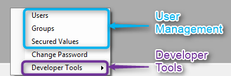
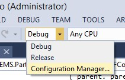

# Access Developer Tools and Users management menu

This article covers the way in which you can access the Developer Tools and the User management menu (Users/Groups/Secured Values)



You can access this menu either from the Options pull down menu or from the task bar context menu

**Administrator Role**

The Super Right Key is the strongest role and overrides all other roles. In other words, user who has this role can access any place in the application including these menus. In case the application was migrated without Super Right Key, the default key is “Administrator”

**Developer Tools**

* The Developer Tools menu is visible only to a user with “DeveloperTools” role or a user with the Administrator role
* Developer tools for all users  
Access to the Developer tools is specified in the  *ApplicationCore.cs*:
```csdiff
#if DEBUG
Common.EnableDeveloperTools = Roles.Administrator.Allowed;
#endif
```
Setting this option to true will enable this menu to all the users.
```csdiff
#if DEBUG
Common.EnableDeveloperTools = true;
#endif
```
Notice that users who have access to this menu can also modify table data so you might consider this option.

* Debug/Release mode  
By default, the menu is enabled only in debug mode. in order to enable it in release mode too, remove the DEBUG constant code and re-build.
```csdiff
#if DEBUG
Common.EnableDeveloperTools = Roles.Administrator.Allowed;;
#endif
```

Debug/Release modes:  


More information about the Developer Tools menu can be found here:<br>
http://doc.fireflymigration.com/using-developer-tools-in-the-alpha-testing-stage.html

**Users Management**

The User Management menu is visible only to a user with “UserManager” role or a user with the Administrator role

All the application roles and keys including the three above are located in Roles.cs under the base project.
