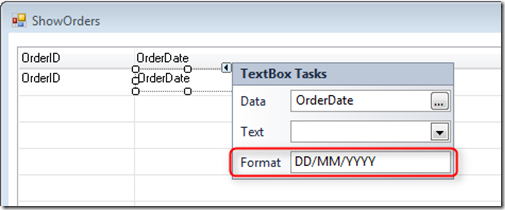
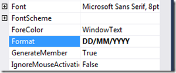
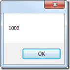
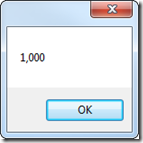

# Formatting

Formatting is a comfortable way to display a value on the form. For example, a telephone number might be stored in the form 8002583826, which is not user-friendly as we would like it to be displayed as 800-258-3826. The solution is to format the value to be more user-friendly and in this article we will cover several types of formatting.

1. Column format
2. Control format
3. ToString() method
4. List of format types

**Column format**

When declaring a local or database column we can specify its format (second parameter)

Let’s break the formatting:  
**N** – Total can display negative number  
**5.2** – Number of digits before and after the decimal point  
**C** – Thousand comma delimiter

So in the example above, if Total=12000, when displaying Total column on the form, the mask of the total will **12,000.00**

**Control Format**

You can specify a format type for the controls on the form. In case the column already has a format type, the format type of the control **overwrites** it,

**ToString() method**

One of the most common methods in .NET is **ToString()**. This method converts any object to its string representation so that it is suitable for display. For example, a message box can display only string values so in order to display a number, we use the ToString() method to convert it to string as below:

Result:

In the FireFly application we override the ToString() method and add a **format type parameter**.

Explanation:

**5** – The Number will be converted to a string with 5 characters and C means  
**C** – The number will be displayed with thousand comma delimiter

The result will be:  

---

## List of format types

**Numeric types**

| Format        | Description                                                                                                                                                                                              |
|---------------|----------------------------------------------------------------------------------------------------------------------------------------------------------------------------------------------------------|
| **N**         | **N** – Numeric. The number can display negative values (**N5**)                                                                                                                                             |
| **P**         | **P** – Pad. If the mask of the number is **5P0** and the user types just one digit, it will be padded with the number following **P**. (Ex – specifying the number 6 will become **00006**.)                |
| **Z**         | **Z** – Zero. In case there is no value in the field, it will be displayed with the character following **Z**.(Ex – if the field mask is **5Z#** and the field is empty, the field will display **#####**)  |
| **L**         | **L** - Lef. The number will be displayed from left to right (Default is right to left) (**5L**)                                                                                                            |
| **A**         | A – Auto. Once the user fills all the possible digits of the numeric field, the cursor moves automatically to the next field. (Ex – A5 mask moves to the next field after typing 5 digits)           |

**Text types**

| Format     | Description                                                                                                                                                                                |
|------------|--------------------------------------------------------------------------------------------------------------------------------------------------------------------------------------------|
| **U**      | **U** – Upper. All the characters typed in the field will be in upper case                                                                                                                     |
| **L**      | **L** – Lower. All the characters typed in the field will be in lower case                                                                                                                     |
| **#**      | This is a place holder for numbers and symbols. Good example is a phone number. 8002583826 will be displayed 800-258-3826 with a format **###-####-####**                                      |
| **A**      | A – Auto. Once the user fills all the possible characters of the text field, the cursor moves automatically to the next field. (Ex – A5 mask moves to the next field after typing 5 chars) |

**Date and Time**

| Format     | Description                                                                                                     |
|------------|-----------------------------------------------------------------------------------------------------------------|
| DD/MM/YYYY | Date will be displayed as **day/month/year**. You can specify the format in several ways: **MM/DD/YYYYY** or **YYYY/DD/MM** |
| ##/##/##   | Will be display either **DD/MM/YY** or **MM/DD/YY** or **YY/MM/DD**.                                                        |
| HH:MM:SS   | **HH** – Hours **MM** – Minutes **SS**– Seconds                                                                             |
| PM         | AM/PM using this option will limit HH to 12                                                                     |

