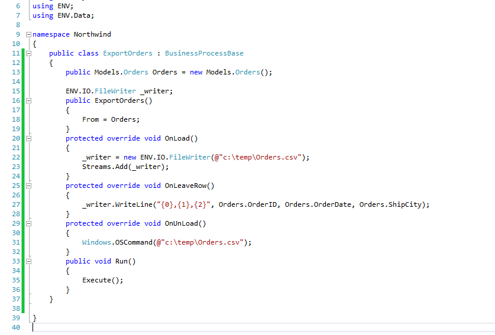

# Export/Import table data to CSV file

**Basic Export**

Below is a simple way to Export data from a table to a CSV file. Notice that in the OnUnload() method we call a Window command to open the file.



Below is the code to copy to your project:
```csdiff
public class ExportOrders : BusinessProcessBase
{
    public Models.Orders Orders = new Models.Orders();
    ENV.IO.FileWriter _writer;
    public ExportOrders()
    {
        From = Orders;
    }
    protected override void OnLoad()
    {
        _writer = new ENV.IO.FileWriter(@”c:\temp\Orders.csv”);
        Streams.Add(_writer);
    }
    protected override void OnLeaveRow()
    {
        _writer.WriteLine(“{0},{1},{2}”, Orders.OrderID, Orders.OrderDate, Orders.ShipCity);
    }
    protected override void OnUnLoad()
    {
        Windows.OSCommand(@”c:\temp\Orders.csv”);
    }
    public void Run()
    {
        Execute();
    }
}
```

**Export/Import using ENV classes**

Please see below: (The classes that are used are below as well)

<iframe width="560" height="315" src="https://www.youtube.com/embed/m62m1rTYc80" frameborder="0" allowfullscreen></iframe>


**SeperatedBuilder class**


```csdiff
using System;
using System.Collections.Generic;
using System.Linq;
using System.Text;
using Firefly.Box;

namespace ENV.IO
{
    public class SeperatedBuilder
    {
        public static string GetString(params object[] columns)
        {
            var sb = new SeperatedBuilder();

            sb.Add(columns);

            return sb.ToString();
        }

        public SeperatedBuilder(params object[] items)
        {
            Add(items);
        }

        List<object> _cells = new List<object>();
        public void Add(params object[] a)
        {
            _cells.AddRange(a);
        }

        public override string ToString()
        {
            var sb = new StringBuilder();
            bool first = true;
            foreach (var item in _cells)
            {
                if (first)
                first = false;
                else
                sb.Append(Seperator);
                var a = item;

                var x = a.ToString();
                if (x.Contains(Seperator))
                x = “\”” + x.Replace(“\””, “\”\””) + “\””;
                sb.Append(x);

            }
            return sb.ToString();
        }
       
        public int Count { get { return _cells.Count; } }

        public object this[int index]
        {
            get { return _cells[index]; }
            set
            {
                var i = index;
                while (_cells.Count <= i)
                _cells.Add(“”);
                _cells[i] = value;
            }
        }

        public static int ConvertLetter(string index)
        {
            int result = 0;
            foreach (var item in index)
            {
                result = result * 26 + (int)item – ‘A’;
            }
            return result;
        }

        public object this[string index]
        {
            get { return this[ConvertLetter(index)]; }
            set { this[ConvertLetter(index)] = value; }
        }

        public char Seperator = ‘,’;
    }
}
```

**SeperatedReader class**

```csdiff

using System;
using System.Collections.Generic;
using System.Linq;
using System.Text;

namespace ENV.IO
{
    public class SeperatedReader : IEnumerable<string>
    {
        List<string> _values = new List<string>();
        string _line;
        public SeperatedReader(string line, char seperator = ‘,’)
        {
            _line = line;
    
            var sr = new System.IO.StringReader(line);
            var sb = new StringBuilder();
            int i = 0;
            bool inQuotes = false;
            while ((i = sr.Read()) != -1)
            {
                if (inQuotes)
                {
                    switch (i)
                    {
                        case ‘\”‘:
                            if (sr.Peek() == ‘\”‘)
                            {
                                sb.Append(‘\”‘);
                                sr.Read();
                            }
                            else
                                inQuotes = false;
                        break;
                        default:
                            sb.Append((char)i);
                        break;
                    }
                }

                else
                    switch (i)
                    {

                        case ‘,’:
                            _values.Add(sb.ToString());
                            sb = new StringBuilder();
                        break;
                        case ‘\”‘:
                            inQuotes = true;
                        break;
                        default:
                          sb.Append((char)i);
                        break;
                    }
            }
            _values.Add(sb.ToString());
            sb = new StringBuilder();
        }
        public string Line { get { return _line; } }
        public string this[int index]
        {
            get { return _values[index]; }

        }
        public int Count { get { return _values.Count; } }
        public string this[string index]
        {
            get { return _values[ConvertLetter(index)]; }
        }
        static int ConvertLetter(string index)
        {
            int result = 0;
            foreach (var item in index)
            {
                result = result * 26 + (int)item – ‘A’;
            }
            return result;
        }

        public IEnumerator<string> GetEnumerator()
        {
            return _values.GetEnumerator();
        }

        System.Collections.IEnumerator System.Collections.IEnumerable.GetEnumerator()
        {
            return _values.GetEnumerator();
        }
    }
}
```
