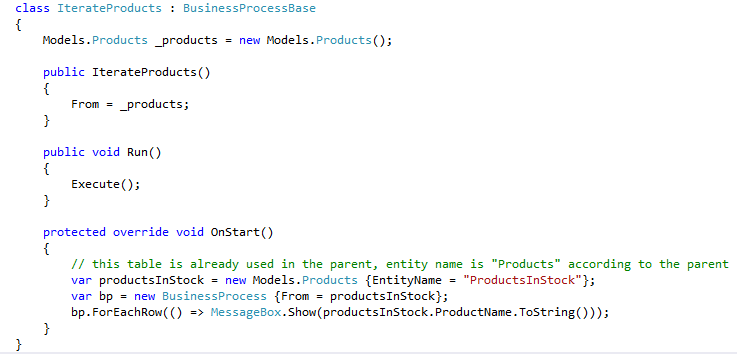
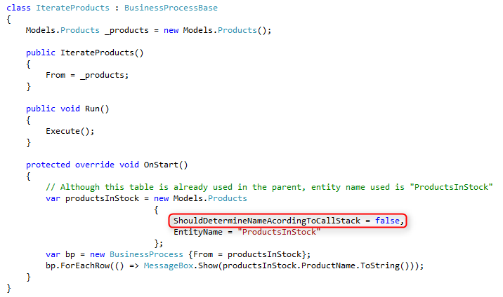

# ENV.Data.Entity.ShouldDetermineNameAccordingToCallStack

Most programs use entity objects to access database tables.

In most cases, the physical name of the table is defined in the entity class. However, sometimes we want to redefine the physical name of the table at runtime, so we set the EntityName property of the entity object to a different name. For example, the following program iterates data of products in stock rather than all products, by changing the entity name:

However, when we change the EntityName property of a table that is used in previous programs in the current call stack, the new name will be ignored and the physical name of the previously opened table will be used. For example, the following program (called from the OnStart method), iterates data of all products and not only products in stock:

This is the default behavior in Magic and once the application is migrated to .NET, it also supports the original functionality of the application, but can be changed in .NET if need be.

The tables of the migrated application are all derived from the ENV.Data.Entity class, which has the “ShouldDertermineNameAccordingToCallStack”property. By default, this property is set to true for backward compatibility with the original application. Setting this property to “false” in a specific program will use the new EntityName, even if the table is previously used in the current call stack. For example, here is the same program that now only iterates products in stock:

It is also possible to change this behavior for the entire application, by changing the default value of the property to “false” in the ENV.Data.Entity base class. Notice that this change affects existing programs that have the specific scenario above, of changing the EntityName of a table that is used by previous programs in the current call stack, so any assignment to the EntityName property should be examined.