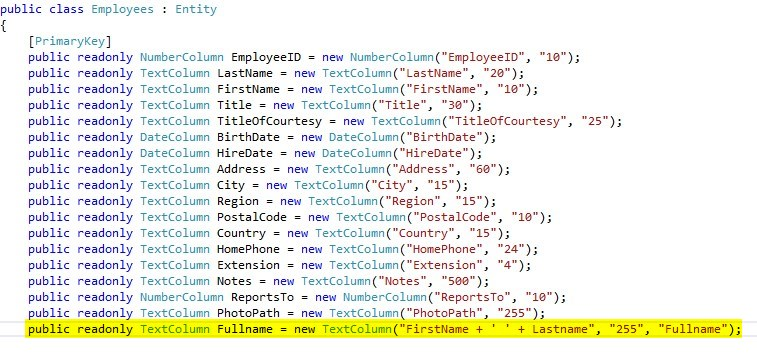
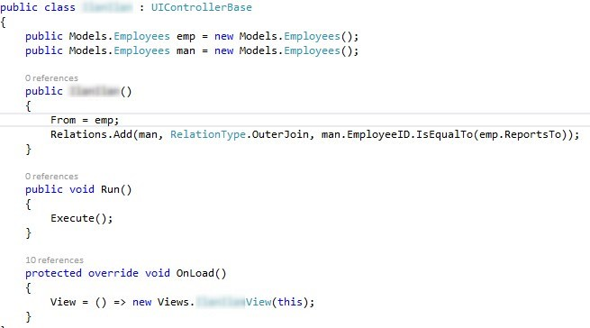
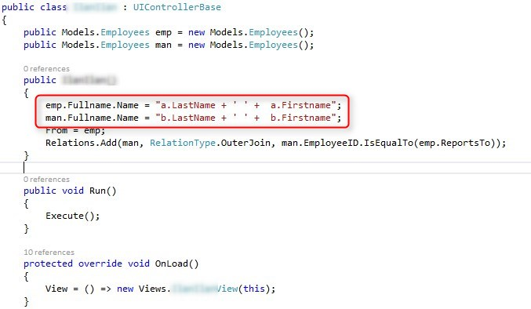
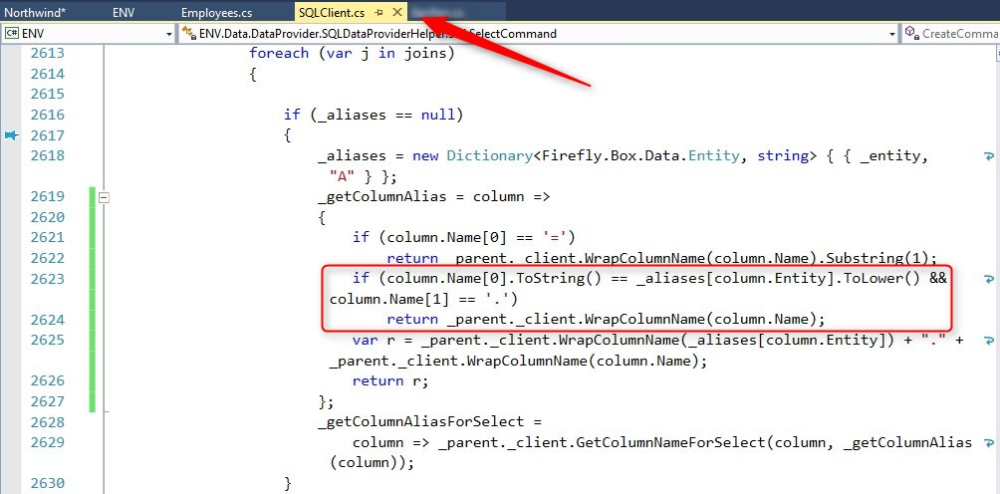
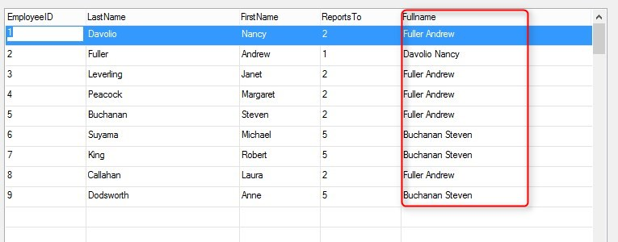

# Define-a-“calculated”-entity-column

There are cases in which we need to use a value based on a calculation done on a column or several columns, an inner select or using an SQL function.

In most cases we were told to use SQL views – this has some downsides (like the fact a view has to be maintained, compiled, has to be for read-only usage, etc.)

In this video you can see another approach of defining a column based on an expression and use it wherever you need:

<iframe width="560" height="315" src="https://www.youtube.com/embed/MYvLYb0zVjk" frameborder="0" allowfullscreen></iframe>

I was asked to check the following requirements:

1. A new column based on two columns from the entity
2. A join will be used in a controller to the same entity.  

This is the entity and the new column:


This is the controller and the join:



This creates a problem in the generated SQL statement, as one of the columns in the new Fullname column will not get an alias:

```
Select A.EmployeeID, A.LastName, A.FirstName, A.Title, A.TitleOfCourtesy, A.BirthDate, A.HireDate, A.Address, A.City, A.Region, A.PostalCode, A.Country, A.HomePhone, A.Extension, A.Notes, A.ReportsTo, A.PhotoPath,
A.FirstName + ‘ ‘ + Lastname, B.EmployeeID, B.LastName, B.FirstName, B.Title, B.TitleOfCourtesy, B.BirthDate, B.HireDate, B.Address, B.City, B.Region, B.PostalCode, B.Country, B.HomePhone, B.Extension, B.Notes, B.ReportsTo, B.PhotoPath, B.FirstName + ‘ ‘ + Lastname
From Employees A
left outer join Employees B on B.EmployeeID = A.ReportsTo
Order by A.EmployeeID
```
In order to make it work, two changes were required.

In the controller – setting the column name (the one sent to the SQL):



In the ENV code that builds the SQL – making sure that  the new column name provided in the controller will not have an added alias:

The result:
