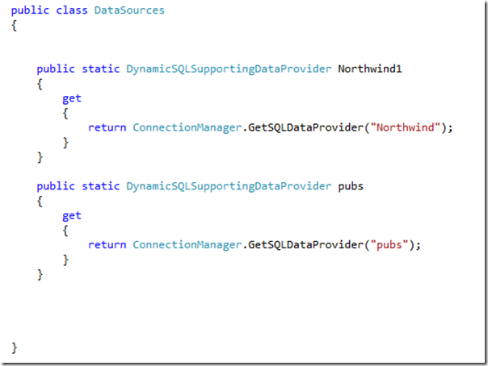
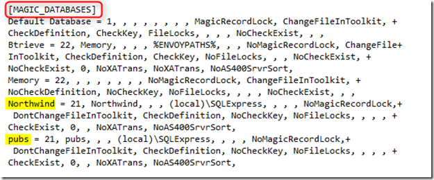

# Adding a new database to the application

There are several ways to add a database connection to the application. In this article, we will focus on a way based on the migrated code.
When adding a new database entry to our migrated application, we need to pay attention to two files:

1. DataSources.cs 
2. INI file (Configuration file)

The **DataSources** class is located in the **Base** project under the Models folder and includes all the databases that are used by the application, similar to the databases list in Magic settings menu.

The **INI file** is imported from Magic and holds the database connection details of the application along with other configuration settings.

## DataSources

In your **DataSources** class you should find at least one database entry and you can add more entries based on the samples in this article.
Below is an example of two connections entries to **SQL databases** (Northwind and pubs)

**SQL**

Each **entry** in this the DataSources class is a database that is used by one or more entities of the application. These entries are called “**Properties**” in C#, which in this case are similar to **methods** with a return value.

Let’s explore an SQL connection property:

**DynamicSQLSupportingDataProvider**

This is the return value which is a connection to an SQL database, rather than a Memory database, XML etc.

**get**

The get property (getter), which is the body of the method, asks the ConnectionManager class for a connection to an SQL database.

**ConnectionManager**

The ConnectionManager is responsible of opening and closing the connection with the database. It uses GetSQLDataProvider method to retrieve the database information from the INI

**GetSQLDataProvider**

This method pulls from the INI the connection details to the database by providing the name of the database entry in the INI file.

When the **application loads**, the ConnectionManager is populated with the connection details from the INI file.

Here are two more common database connections types

**Memory**

**XML**

## INI File

The configuration file (INI) is located in the **root project** (Marked in Bold in the Visual Studio solution).
The file is divided into sections surrounded by square brackets “[ ]” and we will focus on the database section **[MAGIC_DATABASES]**

As you can see, the Northwind and pubs databases are declared in this section and based on their entry names which are marked in yellow, the **GetSQLDataProvider** method we discussed earlier, is retrieving their database information.

## Summary

We saw above two files which we need in order to add a database connection to our application:
1. DataSources.cs
2. INI file (Configuration file)

These two files have one thing in common – **The database entry name**.
Once this is set correctly together with proper connection details in the INI file, the application will be able to issue a database connection.