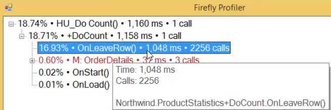

There are cases, where the profiler can direct us to a piece of code that is not granular enough for us to understand the root cause of a performance problem.

For example in our case, the profiler shows that the `OnLeaveRow` is taking a long time.


But that `OnLeaveRow` has 9 lines of code that all seem innocent.

```csdiff
protected override void OnLeaveRow()
{
    v_TotalPrice.Value = OrderDetails.UnitPrice * OrderDetails.Quantity;
    _parent.TotalAmount.Value = v_TotalPrice + _parent.TotalAmount;
    _parent.TotalItems.Value += OrderDetails.Quantity;

    if (OrderDetails.ProductID == _parent.ProductID)
    {
        _parent.ProductItems.Value = _parent.ProductTotalAmount + OrderDetails.Quantity;
        _parent.ProductTotalAmount.Value += v_TotalPrice;
    }
}
```

### How can we get a more granular view of a method?

We can use the Profiler `StartContext` menu, to define a context that we want to measure on it's own.
In the following example we use the `using` statement, and to count and measure anything between the open curly brackets to the closing curly brackets.

```csdiff
protected override void OnLeaveRow()
{
+   using (ENV.Utilities.Profiler.StartContext("Update Line Total"))
+   {
        v_TotalPrice.Value = OrderDetails.UnitPrice * OrderDetails.Quantity;
+   }
    using (ENV.Utilities.Profiler.StartContext("Update Parent Total"))
    {
        _parent.TotalAmount.Value = v_TotalPrice + _parent.TotalAmount;
        _parent.TotalItems.Value += OrderDetails.Quantity;
    }

    if (OrderDetails.ProductID == _parent.ProductID)
    {
        using (ENV.Utilities.Profiler.StartContext("Update Parent Product Total"))
        {
            _parent.ProductItems.Value = _parent.ProductTotalAmount + OrderDetails.Quantity;
            _parent.ProductTotalAmount.Value += v_TotalPrice;
        }
    }
}
```


Let's apply it to the rest of the method
```csdiff
protected override void OnLeaveRow()
{
+   using (ENV.Utilities.Profiler.StartContext("Update Line Total"))
+   {
        v_TotalPrice.Value = OrderDetails.UnitPrice * OrderDetails.Quantity;
+   }

+   using (ENV.Utilities.Profiler.StartContext("Update Parent Total"))
+   {
        _parent.TotalAmount.Value = v_TotalPrice + _parent.TotalAmount;
        _parent.TotalItems.Value += OrderDetails.Quantity;
+   }

    if (OrderDetails.ProductID == _parent.ProductID)
    {
+       using (ENV.Utilities.Profiler.StartContext("Update Parent Product Total"))
+       {
            _parent.ProductItems.Value = _parent.ProductTotalAmount + OrderDetails.Quantity;
            _parent.ProductTotalAmount.Value += v_TotalPrice;
        }
+   }
}
```

Now we can see a more granular breakdown of what's going on in the `OnLeaveRow` method


---
<iframe width="560" height="315" src="https://www.youtube.com/embed/paalsTGeEBE?list=PL1DEQjXG2xnJYzlRYRjwUfqSc4Kx0yarM" frameborder="0" allowfullscreen></iframe>