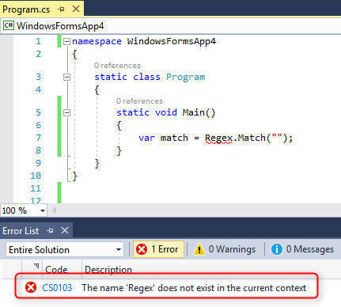
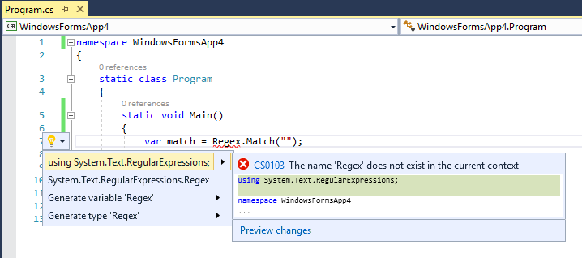
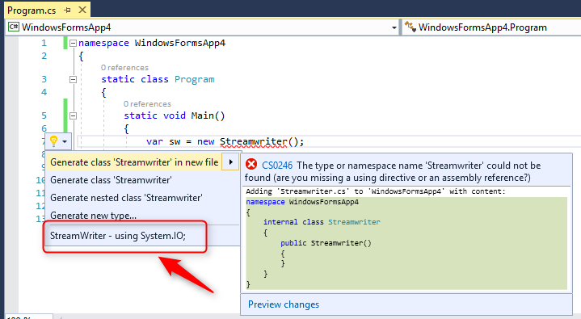
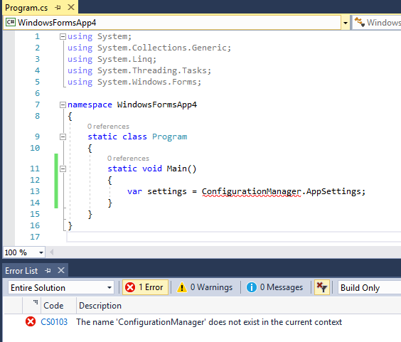
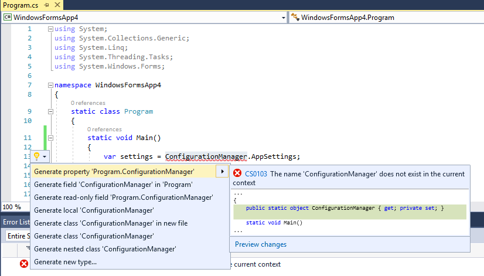
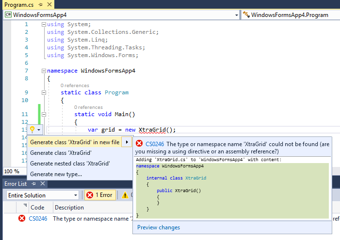

There are many great resources on the web for getting help and finding solutions to our development problems.
The most popular and useful resource is undoubtedly [StackOverflow.com](http://stackoverflow.com).

According to StackOverflow's rules, code samples should be complete. That is, they should work by anyone who copy them as is.
Unfortunately, there are some code samples that are partial and need extra code, such as using directives, in order to execute or even build successfully.
When trying to run the code, we usually get the following error:

In this article we will demo a few cases of code snippets that contain unidentified classes and see how to resolve the missing namespaces.

## Missing using directive ##
The most simple and common case is when the code snippet was copied without the using directives, or contain a class that requires adding a missing using directive.
In this case, Visual Studio can help us resolve the missing namespace. When you see the yellow bulb, click <kbd>CTRL</kbd>+<kbd>.</kbd> to open the Quick Actions menu and there you will have an option to add the missing using directive.

Notice that if the class name has wrong casing, Visual Studio can still guess the correct class name and suggest to fix the class name and add the using directive for its namespace.

## Missing assembly reference ##

Another common problem is when the code contains classes from a .NET assembly which we don't have a reference for in our application.
Let's see an example:

The ConfigurationManger class is part of the namespace (and dll) System.Configuration, which is not referenced by default in windows forms application.
This time, the yellow bulb does not help too much:

If you have Resharper, it can help and suggest to add the missing reference and the using directive:

If you don't have Resharper, you can still easily resolve this, by Googling the class name. If the class is part of the .NET framework, you will usually get the first result from the MSDN.

Go to the class page on MSDN and find at the beginning of the page the assembly name that you need to add reference for and the namespace that you need to add in the using directives.

 

## Missing a reference to a third party dll ##

In some cases the code contains classes from a third party library such as DevExpress or some Nuget Package that is not part of our application.

Visual Studio or Resharper will not be able to guess the missing assembly and will only suggest to create a new type (class) with that name for us.

In order to find out where this class is coming from, it is best to know the context of the code writer.
Try Googling the class name; if the class is popular you should easily find the framework used in the code sample:

If you can't find the class using Google, it is probably part of the application, which the writer of the code has not included.
If this is the case, which is fairly rare, you have no choice but to ask the writer to provide the missing code, or to continue searching for a working example.

