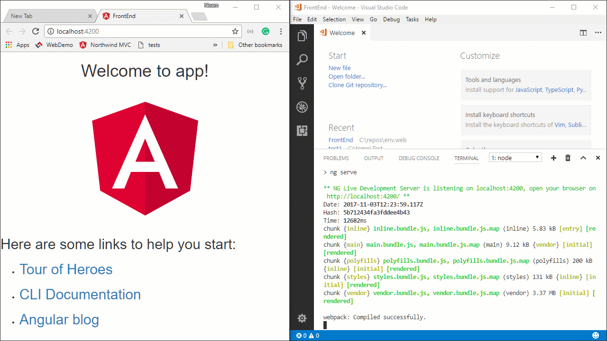

In the terminal window, open another terminal window by clicking on the `+` icon and type:
```
npm run build
```

It'll take it a about half a minute as it builds the FrontEnd site and places the resulting files in the `WebDemo` project.

Whenever you'll want to build the FrontEnd, perform this operation.

