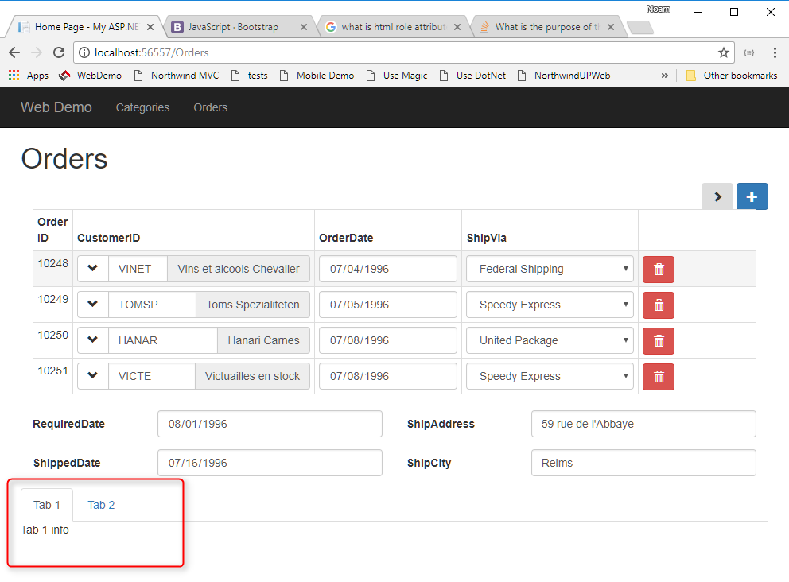

First let's reduce the number of Order rows in the grid:
`Scripts\App\Orders.ts`
```csdiff
orders = new models.orders(
        {
            numOfColumnsInGrid: 4,
+           get: { limit:4 },
            allowUpdate: true,
            allowInsert: true,
            allowDelete: true,
```

### Bootstrap
We'll use bootstrap tab controls. See: 
[Bootstrap tabs](https://getbootstrap.com/docs/3.3/javascript/#tabs)

In the `Scripts\App\Orders.html`
```csdiff
<h1>Orders</h1>
<data-grid [settings]="orders"></data-grid>
<select-popup [settings]="customers"></select-popup>
+ <div>
+     <!-- Nav tabs -->
+     <ul class="nav nav-tabs" role="tablist">
+         <li class="active"><a href="#tab1" data-toggle="tab">Tab 1</a></li>
+         <li><a href="#tab2" data-toggle="tab">Tab 2</a></li>
+     </ul>
+     <!-- Tab panes -->
+     <div class="tab-content">
+         <div class="tab-pane active" id="tab1">
+             Tab 1 info
+         </div>
+         <div  class="tab-pane" id="tab2">
+             Tab 2 Info
+         </div>
+     </div>
+ </div>
```
