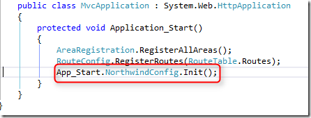

# Configuring The Global.asax file

In the global.asax file, we’ll add a call to the Init method, so that it’ll be called when the application starts:  
  

And we’ll add two more calls that will happen before and after the start of each request:
  

The first one makes sure that if any UIController is called during the execution of the request, it’ll close immediately.

The second makes sure that all resources are freed once a request is completed, making the connection available for other threads that might want to use it.

Here is the global.asax file after the change:
```csdiff
using System;
using System.Collections.Generic;
using System.Linq;
using System.Web;
using System.Web.Mvc;
using System.Web.Routing;

namespace NorthwindWeb
{
    public class MvcApplication : System.Web.HttpApplication
    {
        protected void Application_Start()
        {
            AreaRegistration.RegisterAllAreas();
            RouteConfig.RegisterRoutes(RouteTable.Routes);
            App_Start.NorthwindConfig.Init();
        }
        protected void Application_BeginRequest(object sender, System.EventArgs e)
        {
            Firefly.Box.Context.Current.SetNonUIThread();
        }
        protected void Application_EndRequest(object sender, System.EventArgs e)
        {
            Firefly.Box.Context.Current.Dispose();
        }
    }
}
```

Now you are ready to use MVC. I recommend that you’ll read the “My First MVC Page” article next.