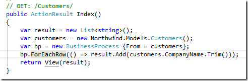
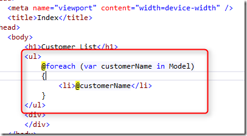
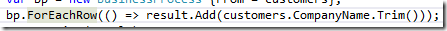
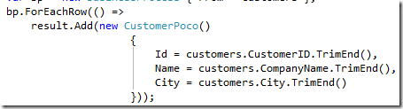
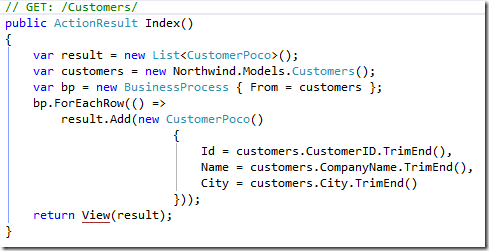
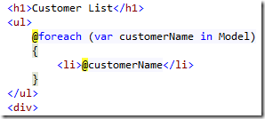
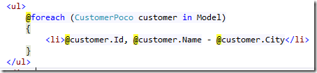
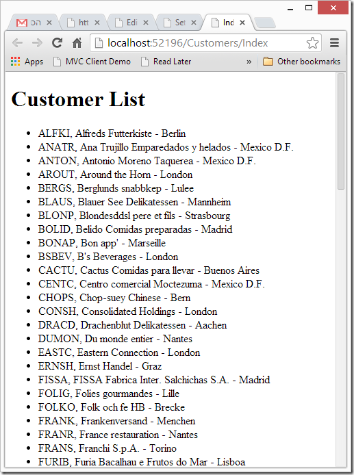

# First quick and dirty

We’ll start by doing it the “quick and dirty” way, expanding the example used in the previous post. Later we’ll refactor it to promote code reuse.

So far, our code displaying the customers looks like this:  


It collects the customers into a list of strings, and that list is later used in the Index.cshtml file:  


To show the customers:


Now, we would like to show not only the customer’s name but also it’s company name and city.

To do that we’ll create a new class, and call it CustomerPoco, and add some fields to it:  


Note that we are using basic types here (in this case string) as those integrate best with the MVC framework.

Next, we’ll alter our code to use these classes for the list, instead of the strings used earlier.

We’ll change it from:  
```csdiff
var result = new List<string>();
```
to :
```csdiff
var result = new List<CustomerPoco>();
``` 

Next we’ll change the business process to create these POCO objects instead of the strings.

We’ll change it from :  


to :  


Here is the entire method:  


So far, for the logic, now we need to adjust the Index.cshtml to use this object.  
We’ll change it from this:  


to:  


Now, when we run it, we’ll get the following result:
