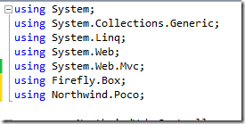
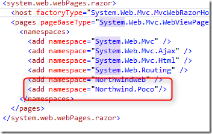

# Refactoring the code for better reuse

So far we have written this code in the quick and dirty way, but now it’s time to grow up. 

This code has a lot of repetitive code. We create the CustomerPoco object in at least four places. That means four places to maintain it, Four places to make any change etc…
Also, this code is in the controller, and I would like to move it to another class, and another project which I can reuse in my migrated code and in new code.

As we are doing it for the first time, it’ll involve some setup and reuse.

We’ll start by adding a new project of type “Class Library”, I’ll call it “Northwind.Poco”.

In that project I’ll reference:

1. ENV
2. Firefly.box.dll
3. NorthwindBase.dll
4. System.Windows.Forms.dll

Now I’ll add a reference from the Web Project to the Northwind.Poco project.  
Next I’ll move the CustomerPoco class to the Northwind.Poco project.  
In the process I’ll have to adjust the “using” statement and also make the CustomerPoco class public.  
  

One more important thing: when using classes from other projects in an MVC application cshtml file, we need to inform MVC of that. To do that we need to update the “web.Config” file that sits **within the “Views” folder**, as opposed to the one that sits in the root folder.  
Here it is:  
  

We’ll just add the namespace of our project to it, and it’ll be able to use it:  
  

If we don’t do this, we’ll get the following error:

Now let’s run and see that everything is working.