# POCO Creator, Next Step: Extending the Generated Objects

This article is part of a series of articles about reusing code from a migrated application in a web project.

To configure and setup a MVC application that reuses migrated code, see Setting Up an MVC Project that Reuses Migrated Code.

Next I recommend you read these articles in the following order:

1. Creating My First MVC Page
2. Using POCO Objects Based on Migrated Entities
3. POCO Creator: Automatically Create POCO Object Based on Entities, (T4 Templates)
4. POCO Creator, Next Step: Extending the Generated Objects – this article
5. Reusing Migrated Reports on the Web

In the previous post, we have seen how to automatically create the Products POCO Object, based on the columns in it’s Entity.

But sometimes, we would like to add columns to it that don’t already exist in the Entity.

For example, in the previous post we created the ProductsController’s Index method.
Here is the View code:  
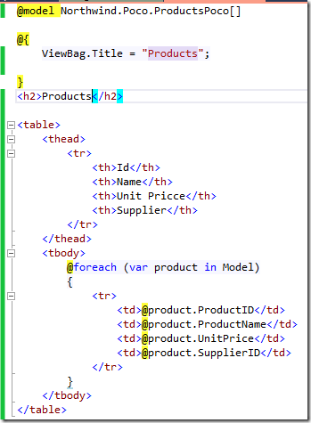

When we run it, we get the following result in the browser:  
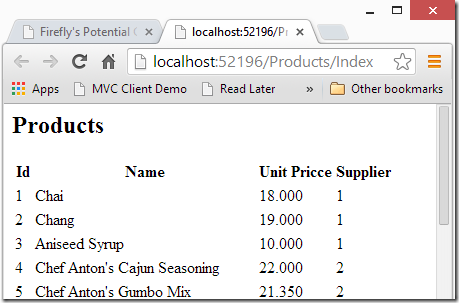

See how we got the supplier code? Our users prefer to get it’s name, so we would like to add another member to the ProductsPoco which will have the supplier name.

When you look at the ProductsPoco class, you can see that it’s a “partial” class; that means that we can add another class to the same project, and also tag in as “partial”, causing the .NET framework to merge the two “partial” classes into one.  
So let’s do that:  
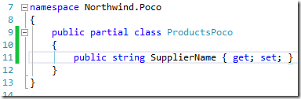

Next we need to put some data into it, which will change the line in the “CreatePoco.tt” file, and send true as the second parameter:  
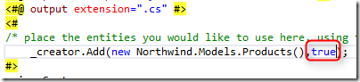
This instructs the PocoCreator to create an abstract ProductsPocoProvider instead of the PocoProvider created earlier, called ProductsPocoProviderBase. Here is the code from the generated file:  

Next, we’ll add a class called ProductsPocoProvider that will inherit from the ProductsPocoProviderBase class. The ProductsPocoProviderBase has an overrideable method called “CreatePoco” that is called every time a new ProductsPoco is created. In that method we’ll get the supplier’s name as following:  
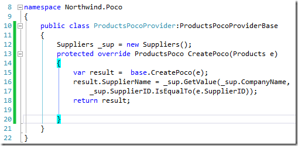

That’s it. Now let’s change the View’s code to display the supplier name:  
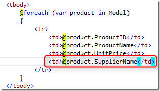

And get the following result in the browser:

In the same way, we can also override the “UpdateEntityBasedOnPoco” method to control the way the Entity is updated based on the POCO.

## Master Detail

Next we would like to show a master detail list in which we want to show the Categories, and for each Category, we’ll have a list of the Products that exist in that Category.

First we’ll instruct the “CreatePoco” to also create a POCO for the Categories table:  
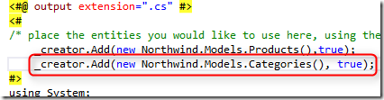

This will create a CategoriesPoco partial class, and a CategoriesPocoProviderBase abstract class.

Next, we’ll create another “partial” class called CategoriesPoco, and add to it an Array member that will hold the Products:  
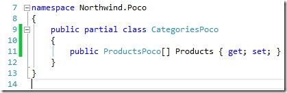

Then we’ll create a class called “CategoriesPocoProvider” that will inherit from the “CategoriesPocoProviderBase” class and override the CreatePoco method to populate the Products member, using the ProductsPocoProvider:  
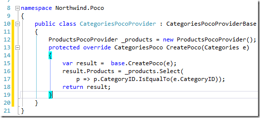

That’s it; that’s the wiring! Now all that is left is to create the Controller and View to display it.
Controller:

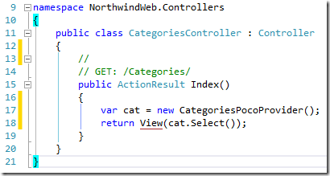

View:
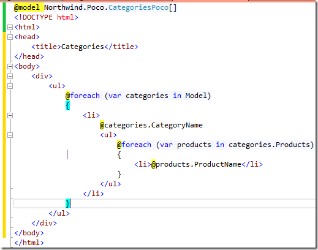

And here is the result we got in the browser:  
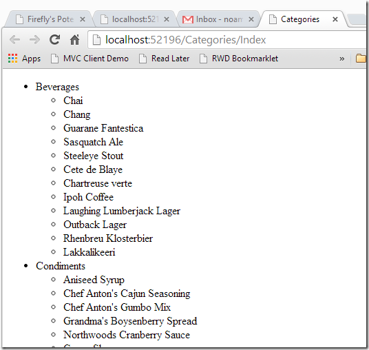

