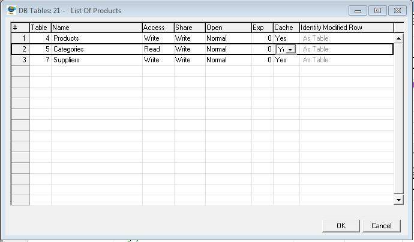

# Comparison with Magic's DB Tables Dialog Box

## Introduction
This article is one of a series of articles aimed at providing further orientation with the migrated code for Magic programmers. This time we will look at the 'DB tables' screen as it appears in eDeveloper (version 9) and show the equivalent representation of each setting in the migrated code.

Recall that in Magic you press Ctrl + D and The DB Tables screen appears as shown below:



## Table Declaration
* At the beginning of the class,in the 'Model' region, declare an object Property for each table to be used.
* Example: ``` internal readonly Model.Orders Orders = new Model.Orders(); ```
* Example of a Table definition with some properties:
```csdiff
 internal readonly Model.Orders Orders = new Model.Orders
{
  Cached = false,
  AllowRowLocking = true,
  //other options
}
```
---

## Table Options
* A Table in .Net is an object of the Entity Class defined in ENV.Data.Entity.cs
* Note that the Entity Class members include Properties used when defining indexes for tables.
* For a full list of members of the Entity Class see: [Entity Members](http://www.fireflymigration.com/reference/html/AllMembers_T_Firefly_Box_Data_Entity.htm)
* The following subsections discuss the equivalent of Magic Table options in the migrated code for the DB Tables (Ctrl-D) screen.

---

### Access

#### Read

Name in Migrated Code: **ReadOnly**
Location in Migrated Code: **Class** (in Model region)
Example:
```csdiff
readonly Model.Orders _orders = new Model.Orders()
{
   ReadOnly = true,
   //other code
};
```
##### See Also :
* [ReadOnly Property](http://www.fireflymigration.com/reference/html/P_Firefly_Box_Data_Entity_ReadOnly.htm) 

---

#### Write

Name in Migrated Code: **AllowRowLocking**
Location in Migrated Code: **Class** (in Model region)
Example:
```csdiff
readonly Model.Orders _orders = new Model.Orders
            {
            	AllowRowLocking = true,
                //other code
            };
```     

##### See Also :
* [AllowRowLocking Property](http://www.fireflymigration.com/reference/html/P_Firefly_Box_Data_Entity_AllowRowLocking.htm) 

---
    
### Share

Relevant only for Btrieve

---

### Open

Relevant only for Btrieve

---

### Exp

Name in Migrated Code: **EntityName**
Location in Migrated Code: **OnLoad Method**
Example:
```csdiff
protected override void OnLoad()
{
  Customers.EntityName = "%PATH%FileName";
}
```
---

### Cache

Name in Migrated Code: **Cached**
Location in Migrated Code: **Class** (in Model region)
Example: Cache = Yes:
```csdiff
readonly Model.Orders _orders = new Model.Orders
            {
            	Cached = true,
                //other code
            };
```
Example: Cache = No:
```csdiff
readonly Model.Orders _orders = new Model.Orders
            {
            	Cached = false,
                //other code
            };
```

##### See Also:
* [Cached Property](http://www.fireflymigration.com/reference/html/P_Firefly_Box_Data_Entity_Cached.htm)
Note: For an article regarding optimization for Relations (linked tables) using cache, see:[Relations In Depth](Relations-in-depth.html)