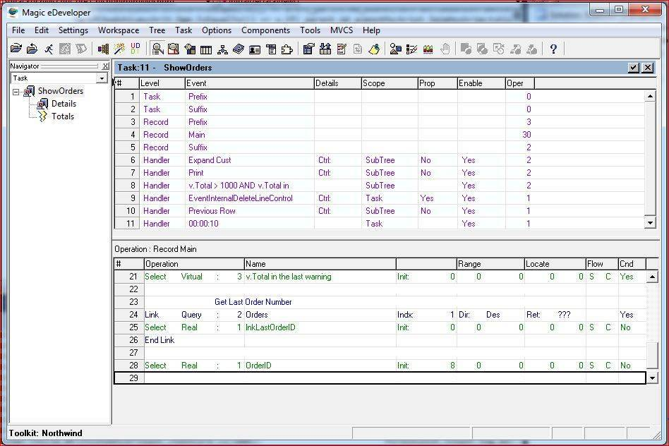
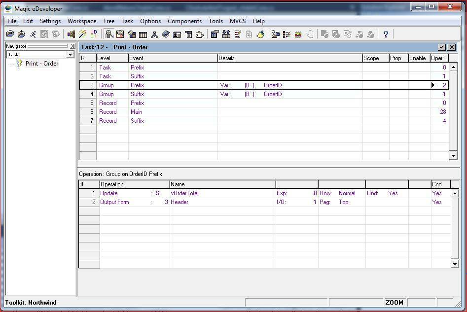

# Introduction
This article is one of a series of articles aimed at providing further orientation with the migrated code for Magic programmers. This time we will look at the different States as they appear in eDeveloper (version 9) and show the equivalent representation of each setting in the migrated code.

We will discuss Online and Batch task types. Both share common states and each also has unique states of its own. The following table shows the syntax in .Net for each magic state.

| Magic Name           | Migrated Code Name | Occurs in                     |
|----------------------|--------------------|-------------------------------|
| Properties           | OnLoad             | UIController, BusinessProcess |
| TaskPrefix           | OnStart            | UIController, BusinessProcess |
| TaskSuffix           | OnEnd              | UIController, BusinessProcess |
| RecordPrefix         | OnEnterRow         | UIController, BusinessProcess |
| RecordSuffix         | OnSavingRow        | UIController, BusinessProcess |
|                      | OnLeaveRow         | BusinessProcess only          |
| GroupPrefix          | delegate call      | BusinessProcess only          |
| GroupSuffix          | delegate call      | BusinessProcess only          |
| Control Prefix       | .Net Event         | UIController only             |
| Control Suffix       | .Net Event         | UIController only             |
| Control Verification | .Net Event         | UIController only             |
| Control Change       | .Net Event         | UIController only             |
| Handler              | .Net Method        | UIController, BusinessProcess |  

---
  
## Online States
Let's first look at an example of a screen displaying different Online states:




### Load Properties

This refers to all properties that appear in screens such as Ctrl+P (Task Properties), Ctrl+C (Task Control), Ctrl+I (Media Properties), etc.

Name in Migrated Code: **OnLoad Method**  
Example:
```csdiff
protected override void OnLoad()
{
   AllowSelect = true;
   Activity = Activities.Browse;  
}
```

### Task Prefix

Name in Migrated Code: **OnStart Method**  
Example:
```csdiff
protected override void OnStart()
{
     v_myNumberColumnField.Value = 0;
      u.DBDel(typeof(Model.myFileName), "");
}
```

### Task Suffix

Name in Migrated Code: **OnEnd Method**  
Example:
```csdiff
protected override void OnEnd()
{
     _taskresult = vMyValue;
     new ClosingMethod().Run();
}
```

### Record Prefix

Name in Migrated Code: **OnEnterRow Method**  
Example:
```csdiff
protected override void OnEnterRow()
{
     new MethodtoRUnBeforeEachEachRow().Run();
}
```

### Record Suffix

Name in Migrated Code: **OnSavingRow Method**

### Record Main

Name in Migrated Code: **Constructor and Run Method**  
Example:
```csdiff
/// <summary>ShowProducts(P#10)</summary>
public ShowProducts()
{
    Title = "ShowProducts";
    InitializeDataViewAndUserFlow();
}
void InitializeDataViewAndUserFlow()
{
    From = Products;
    OrderBy.Add(Products.ProductName);
    OrderBy.Add(Products.UnitPrice, SortDirection.Descending);
    // parameter for selection task
    Columns.Add(pi_ProdID);
    Columns.Add(Products.ProductID);
    Columns.Add(Products.ProductName);
    Columns.Add(Products.UnitPrice);
    Columns.Add(stam);
    }
    /// <summary>Run</summary>
    /// <param name="ppi_ProdID">pi.Prod ID</param>
    public void Run(NumberParameter ppi_ProdID)
    {
       BindParameter(pi_ProdID, ppi_ProdID);
       Execute();
    }
```

### Controls

Name in Migrated Code: **User Defined Method**  
Location in Migrated code: Controls handlers section, (after the Expressions section)  
Controls obviously appear only in UIController code and can have the following four states:


#### Control Prefix

Methods of this type in the migrated code have names ending with **_Enter**

Example:
```csdiff
#region Controls handlers
internal void txtCustomers_CustomerID_Enter()
{
   //code
}
#endregion
```

#### Control Suffix

Methods of this type in the migrated code have names ending with **_Leave**

Example:
```csdiff
#region Controls handlers
internal void txtCustomers_CustomerID_Leave()
{
   //code
}
#endregion
```

#### Control Verification

Methods of this type in the migrated code have names ending with **_InputValidation**

Example:
```csdiff
#region Controls handlers
internal void txtCustomers_CustomerID_InputValidation()
{
   //code
}
#endregion
```

#### Control Change

Methods of this type in the migrated code have names ending with **_Change**

Example:
```csdiff
#region Controls handlers
internal void txtCustomers_CustomerID_Change()
{
   //code
}
#endregion
```

---

## Batch States
Now let's look at an example of a screen displaying different Batch states.



Most of these states are the same as the Online ones, with the exception of the following:

### Record Suffix

Name in Migrated Code: **OnLeaveRow, OnSavingRow Methods**  

OnLeaveRow() occurs after leaving every record as opposed to OnSavingRow() which occurs only when data from the record needs to be saved to the Database. Thus, for a record that needs to also be saved to the database, both **OnLeaveRow** and **OnSavingRow** events will occur.

Example: OnLeaveRow:
```csdiff
protected override void OnLeaveRow()
{
    _layout.Body.WriteTo(_ioPrint_Order);
    if(false)
    {
       StartRun("dir", false, System.Diagnostics.ProcessWindowStyle.Normal);
    }
    new ENV.Utilities.FileViewer("c:\\temp\\test.txt",new UI.Print_Orders_Browse(this)).Edit();
}
```

### Groups

Name in Migrated Code: **Groups.Add() Method**
Location in Migrated code: **constructor**

#### GroupPrefix

Groups.Add defines the grouping for the selected variables, while groupname.Enter and groupname.Leave represent the GroupPrefix and the GroupSuffix respectively.  
Example: First lets look at usage of Groups.Add in the Constructor:
```csdiff
public Print_Orders()
{
   Title = "Print - Orders";
   InitializeDataView();
   _layout = new Printing.Print_Orders_Layout(this);
   var Orders_CustomerIDGroup = Groups.Add(Orders.CustomerID);
   Orders_CustomerIDGroup.Enter += Orders_CustomerIDGroup_Enter;
   Orders_CustomerIDGroup.Leave += Orders_CustomerIDGroup_Enter;
}
```

#### GroupSuffix

Next, lets look at the delegate method call for the Group Prefix, using Group.Enter:
```csdiff
void Orders_CustomerIDGroup_Enter()
{
   _layout.CustomerGroupHeader.WriteTo(_ioPrint_Order);
} 
```

Finally, lets look at the delegate method call for the Group Suffix, using Group.Leave:
```csdiff
void Orders_CustomerIDGroup_Leave()
{
   _layout.CustomerGroupFooter.WriteTo(_ioPrint_Order);
} 
```