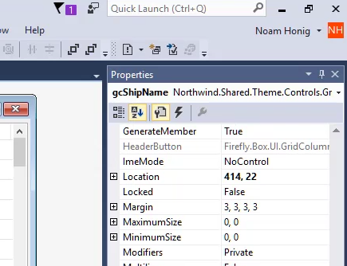
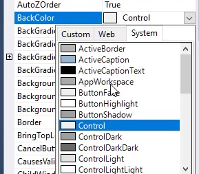
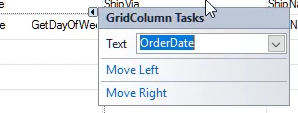

First let's start with:
## Control Properties

In this section we'll:
* Review the properties tab in visual studio
* See that at the top of the tab we can see the control's `Name` and it's type

* Talk about several properties:
  * The Text Property
  * BackColor Property

* Discuss the "Quick Properties" window where we can change the most commonly used properties of a control

* We can use the "Move Left" and "Move Right" links on the screen to move a "GridColumn" left or right in the grid

<iframe width="560" height="315" src="https://www.youtube.com/embed/6bghqa_AjGs?list=PL1DEQjXG2xnKm36EZepT3dIiM5E8s5W0f" frameborder="0" allowfullscreen></iframe>