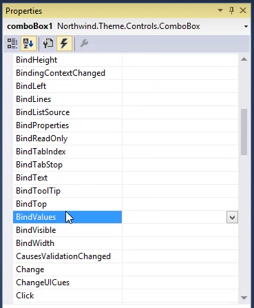

In this article we'll bind the ComboBox's `Values` property to an expression that is based on another local column. We'll
* Start by adding a new local Column called "Values" and place a TextBox that is bound to it on the View

```csdiff
class DemoComboBox:UIController
{
+   public TextColumn Values = new TextColumn("Values");
}
```

* To Bind the `Values` property to an expression, we'll use the `BindValues` event, in the events tab of the property sheet.

```csdiff
private void comboBox1_BindValues(object sender, StringBindingEventArgs e)
{
+   e.Value = _controller.Values;
}
```
* Run the controller and see how when we change the value in the`Values` TextBox, the options of the ComboBox, change accordingly.
* We can also do the same for `DisplayValues`, by adding a local column called `DisplayValues` and then binding the `DisplayValues` property, using the `BindDisplayValues` event.

### Adding the local column to the Controller
```csdiff
class DemoComboBox:UIController
{
    public TextColumn Values = new TextColumn("Values");
+   public TextColumn DisplayValues = new TextColumn("Display Values");
}
```

### Implementing the BindDisplayValues method in the View
```csdiff

private void comboBox1_BindDisplayValues(object sender, StringBindingEventArgs e)
{
+   e.Value = _controller.DisplayValues;
}
```

<iframe width="560" height="315" src="https://www.youtube.com/embed/SeOM5oiKbDg?list=PL1DEQjXG2xnIm0e_t85TXwY-Y9r19m-Mz" frameborder="0" allowfullscreen></iframe>