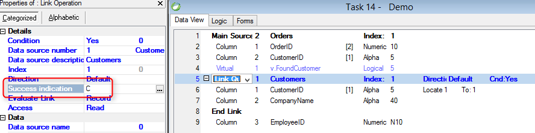

Name in Migrated Code: **NotifyRowWasFound**  
Name in older magic versions: **Ret**  
Location in Migrated Code: **InitializeDataView Method**  
Examples:  
```csdiff 
void InitializeDataView()
{
    From = Orders;
            
    Relations.Add(Customers, Customers.CustomerID.IsEqualTo(Orders.CustomerID), Customers.SortByPK_Customers);
+   Relations[Customers].NotifyRowWasFoundTo(v_FoundCustomer);
}
```

Screenshot on Magic:


It is not recommended to use this in new code, instead we recommend to use the RowFound property of a relation see  
[Replace NotifyRowWasFound with RowFound and Contains](03-Replace-NotifyRowWasFound-with-RowFound-and-Contains.md)