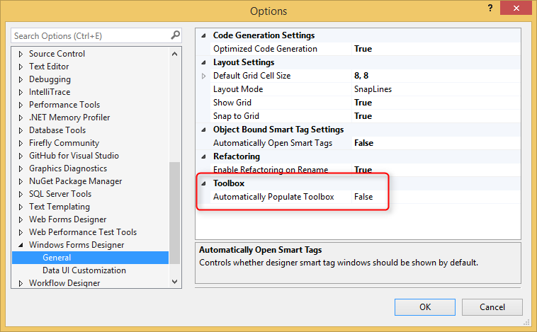
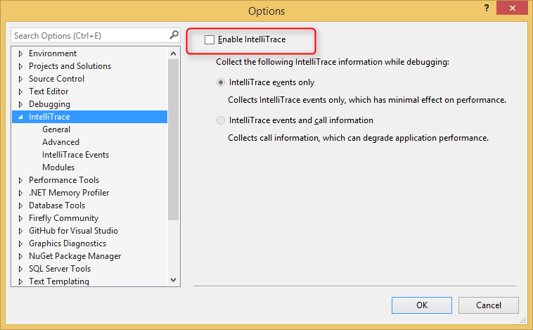
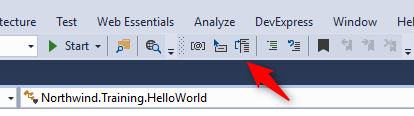

# Configuring Visual Studio 2015

**Set the "Automatically Populate Toolbox" flag to false**
1. Go to Tools Menu -> Options
2. At the left window select Window Forms Designer -> general
3. At the right under Toolbox section set the Automatically Populate Toolbox to False

 

**Disable IntelliTrace**  
The IntelliTrace default setting is true and causes Visual Studio to slow down.
We recommend to change it to false
1. Go to Tools Menu -> Options 
2. At the left window stand on IntelliTrace
3. Uncheck the 'Enable IntelliTrace' check box

 

**Toggle completion modes toolbox**   
Make sure that the toggle completion modes toolbox item is not checked.
You can also find it in the menu:
1. Edit
2. IntelliSense
3. Toggle completion modes.

**Parameter information**  
Add the parameter information icon to visual studio toolbox.
1. Click the small arrow to add mote icons to the tool bar
2. Select Add or remove buttons
3. Make sure the Parameter Info is checked
