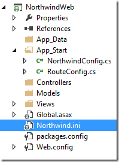

# Application setup code

The original migrated application does it’s basic setup in the “Program.Main” method.

That setup includes loading the ini file and similar operations.

We’ll start by copying the ini from the migrated project to the web project:  
  

In MVC it’s customary to put such configuration code in the “App_Start” folder.

We’ll add a new class and call it “NorthwindConfig”:  
   

To that class we’ll add a method that will perform all the required configuration.  
  

```csdiff
using System;
using System.Collections.Generic;
using System.Linq;
using System.Web;
using ENV;

namespace NorthwindWeb.App_Start
{
    public class NorthwindConfig
    {
        public static void Init()
        {
            Common.SuppressDialogs();
            ENV.Data.DataProvider.ConnectionManager.UseConnectionPool = true;
            //ENV.UserSettings.Version10Compatible = true; use only if you are using uniPaaS INI 

            //ENV.Data.DataProvider.OracleHelper.UseOracleODPClient("DD/MM/YYYY", "BINARY", ".,"); When using Oracle
            ENV.Data.DateColumn.GlobalDefault = new Firefly.Box.Date(1901, 1, 1);

            UserSettings.LoadIniFile(HttpContext.Current.Server.MapPath("Northwind.ini"));
        }
    }
}
```

To explain in detail:

1. Line 12 indicated that the application shouldn’t display message boxes etc…
2. Line 13 – indicated that the application should use .NET connection pools, which means that it’ll open connects and reuse them for multiple requests, using more connections when there is a load on the server, and less when the load is smaller.
3. Line 14-15 loads the configuration from the ini file. The “MapPath” method is used to reference the ini in the project directory. You can use any other path.

In this method you should put any other configuration code that exists in the Program.Main, like “UserSettings.Version10Compatible = true;” for applications that were migrated from uniPaaS etc…