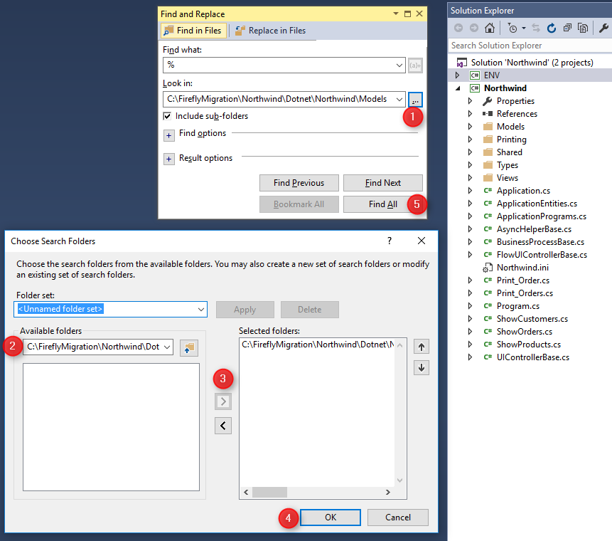

## About SQL Migration
At this stage you should already be using the migrated .NET application with your original Btrieve database.
Everything works great and it's time to migrate the data as well.
Firefly provides a fast and easy way to migrate all your data from Btrieve to SQL server. 
In addition, the migrated .NET application is already designed to work with SQL server.


## Preparing for SQL migration
The migrated application has been designed to work in both Btrieve and in SQL with the same code base. 
This allows you to migrate your customers to SQL gradually, while you can continue developing the application and serve both Btrieve and SQL customers.

Firefly has invested a lot in making the application behave exactly the same both in SQL and in Btrieve. This includes:
1. Optimal SQL Schema design
2. Object naming
3.  Primary key violations detecting
4. Identical transactions and locking behavior (a Main issue when migrating in Magic)
5. Identical sorting behavior
6. Code that runs on both databases, configured by a feature flag.
7. Superior tuning tools

## What You Can Do To Prepare
There are special cases that are unique to your application, which may need some manual adjustment.

In general, anything in the application that is tied to Btrieve technology might need adjustment or at least be considered.

Please find below a list of  usages that might exist in your application and need to be considered.
If you think you have any of the following cases in your application, **please provide an example of how you use it __from the user perspective.__**   
We need to see the scenario running in Btrieve, so we will be able to see the exact same results when running in SQL.  
Firefly is here to help and guide you through this process.
We will examine each scenario and advise about the right solution for your specific application.

With the delivery of the SQL version of the application, we will show you how to apply the solution
and make sure that it works in SQL using the same tests cases you provide.

## Dynamic names of tables 

### Using Logical Names
Logical names can be used in two places:

1. Using logical names for table names in the tables repository (Shift + F2) and set the logical name in runtime using the IniPut() function or by using different ini file for different systems / users.


2. In the dabases settings, using logical name as the location


To find usages of logical names in your tables, search for "%" in the Models folders, as follows:


Once you have all the logical names that are used in your tables, find their optional values in the ini file and by searching for "u.IniPut("[MAGIC_LOGICAL_NAMES]yourlogicalname".
Create a list of all the logical names and their possible values and send us, so that we will make sure that all the instances of each table will be migrated.

### Using Expresssions for Table Name
Using expressions for table names in DB tables (Ctrl + D). For example, a program can change the table name so that it ends with the terminal number (using the Term() function).  
**To find usage of expressions in Ctrl+D search for the text "EntityName = ".**
```csdiff
protected override void OnLoad()
{
+    Orders.EntityName = "Orders2016.DAT";
}
```

## Referencing data tables as regular files
In Btrieve, all tables are files on disk that could be copied, renamed, deleted just like any other file. 
In SQL the tables are stored in SQL server database and are not accessed from the file system.  

These are the most common functions that manipulate files in the application, which you should search for in the code:

Function | What to search for
-------- |-------------------
IORen    | u.IORen(          
IODel    | u.IODel(
IOCopy   | u.IOCopy(
IOExist  | u.IOExist(
IOSize   | u.IOSize(

#### Migrating from uniPaaS may also include the following:
Function    | What to search for
----------- |-------------------
FileRename  | u.FileRename(          
FileDelete  | u.FileDelete(
FileCopy    | u.FileCopy(
FileExist   | u.FileExist(
FileSize    | u.FileSize(

#### Searching for usages in Visual Studio
In Visual Studio, search for "u.IO" to find all of the above functions at once, as follows:
1. Open the full solution of the migrated application in Visual Studio
2. Press Ctrl+Shift+F
3. In Find What: enter 'u.IO'
4. In Look In: select 'Entire Solution'
5. Press 'Find All'
6. The result will be displayed in "Find Result #" window
7. Click on each result to go to the code (ignore the cases found in the ENV namespace)


 

#### Example for code that is harmless

```csdiff
protected override OnStart()
{
+   u.IODel("logo.bmp");
}
```

#### Example for code that should be considered
```csdiff
protected override OnStart()
{
+   u.IODel("Orders.DAT");
}
```

### OS Command
**Search for "ENV.Windows.OSCommand("** to find all the usages of the OSCommand and check if the command has anything to do with data files.

#### Example for code that is harmless

```csdiff
protected override OnStart()
{
+   ENV.Windows.OSCommand("excel \"" + fileName + "\"");
}
```

#### Example for code that should be considered
```csdiff
protected override OnStart()
{
+    ENV.Windows.OSCommand("cmd /C xcopy " + "Orders.DAT Orders2016.DAT");
}
```


## Pervasive (a.k.a Actian) PSQL and SQL Commands (Ctrl + Q)
If you have used PSQL to enable SQL commands (Direct SQL) to your tables via ODBC, the SQL code may need to be adjusted.
**Search for “new DynamicSQL” to find all the usages in your application.**
```csdiff
void InitializeDataView()
{
+    sqlEntity = new DynamicSQLEntity(Northwind.Shared.DataSources.SQL, 
+@"SELECT ""OrderID"", Count(*) as OrderItems
FROM ""Order Details"" 
WHERE ""CustomerID""=:1";
}
```


## Sharing the same data file by different tables
A data file can be shared by different applications, or even be used by multiple tables of the same application.
For example, you may use the Cities table in several applications that refer to the same physical data file.
If a new city is added by one of the application, it will be available to all applications that use the same file.

Another example is when using the same data file by different tables:


Another version of this case may also be found in EntityName expressions, as follows:


### Using the same table structure with different column names
In Btrieve, it is possible to use the same data file with different entries in the table repository (Shift + F2) that have the same structure and differ only by the column names.


## Dll calls to Btrieve (W32mkde)
This is not very common but we have seen some applications that have calls to the Btrieve dll.
**Search for "W32mkde"** to check if such calls exists in your application.  
When using **Pervasive** search for **"W3dbmsgr"** instead.


# Summary
The most important purpose of this article is to list the special cases that need to be considered when migrating the data from Btrieve to SQL.
Now that you are aware of all them, please make sure you have use cases in your application that you can demonstrate to Firefly. Together we will decide on the best solution that you can apply to your specific application.
Firefly will deliver a version with some adjustments to the data migration engine, based on these decisions.
