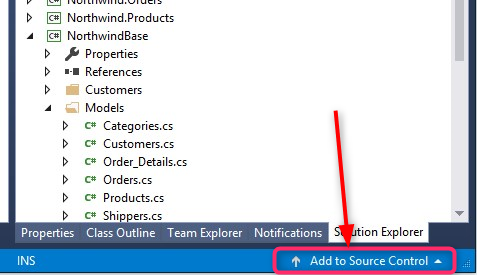
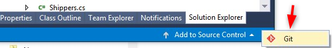

# Exercise - Creating a Simple Screen

1. First we will add **Northwind** to Git.
2. Click on the bottom right rornner of Visual Studio option **Add to Source Control**.

3. Click and select the option to add to Git.

4. After a bit of time the status bar will update and **Team Explorer** panel will open

5. Now your code is in local Git.
6. Change back to the **Solution Explorer** panel.

6. Right click on the **Northwind** project, select **Add** then select **New Folder**, name the new folder **“Exercises”**.
7.  Right click **“Exercises”** and select **Add** then select **New Item**, an Add nmew Item screen will open.
8.  Select from the list to the left **Templates**, and from the list in the center of the screen select **UIController**
9.  In the **Name box** at the bottom of the screen type in the name **ShowProducts**.
10.	Define the **Products** table at the beginning of the controller class.(drag and drop it, holding the **Shift** key just before the drop).
11.  In the **constructor** use the **From** to set the **Products** to be the class main table.
12.  Build the **Northwind** Project. (in the **Build** pulldown menu, select **Build Northwind**).
13.	Using the **Class Outline** Open the Form Designer:  
    1.  Setup the Toolbox if you did not do that early, by right clicking on the form, select "Setup Toolbox".  
    1.  Add a grid with the following columns:  
        1.  ProductID
        1.  ProductName
        1.  CategoryID
        1.  UnitPrice
        1.  UnitsInStock
        1.  UnitsOnOrder
1.  Expand the form width to show the entire grid. 
1.	Add a new menu entry to call this screen.
1.	Build and test.
