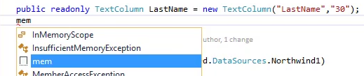

* Use the "Public Member" snippet to add new columns. We can use it's shortcut 'mem'



```csdiff
using System;
using System.Collections.Generic;
using System.Text;
using Firefly.Box;
using ENV.Data;

namespace Northwind.Models
{
    public class Students : Entity
    {
        public readonly NumberColumn Id = new NumberColumn("Id", "5");
+       public readonly TextColumn LastName = new TextColumn("LastName", "30");
+       public readonly TextColumn FirstName = new TextColumn("FirstName", "30");
        public Students()
           : base("Students", Northwind.Shared.DataSources.Northwind1)
        {
        }
    }
}
```

<iframe width="560" height="315" src="https://www.youtube.com/embed/6250zp3kcUg?list=PL1DEQjXG2xnItyh3tX-1kfE3K50w48PNA" frameborder="0" allowfullscreen></iframe>
