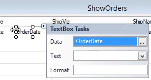

In this article We'll:

* Review the different data types that are used in the migration and their unique attributes

[MigratedDataTypes Power Point Presentation](MigratedDataTypes.pptx)

* Create a GetDayOfWeek method and bind a control to the result of this method.
* Explain the different parts of the method
* We need the method to be `internal` or `public` because we want to use it in another class - the `ShowOrdersView` class
* The method has to have the one of the migrated return types `Text`, `Number`, `Date`, `Time` or `Bool`
```csdiff
internal Text GetDayOfWeek()
{
    return Orders.OrderDate.DayOfWeek.ToString();
}
```

* Review the Property Sheet in the Visual Studio Designer
* Explain about the quick properties window


* We'll review the "Select Data" window, and explain that we have the controller, the tables, and the new `GetDayOfWeek` method


<iframe width="560" height="315" src="https://www.youtube.com/embed/sVi8uQlCBNE?list=PL1DEQjXG2xnKm-XBP3t3KCFZzWMVogMlj" frameborder="0" allowfullscreen></iframe>


To learn more about the migrated data types see [Migrated DataTypes Demos](migrated-datatypes-demos.html)