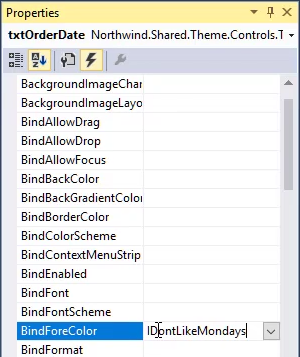

* When we want to automatically change a value of a "Property" based on an expression we'll use the "BindEvents"
* By using the "BindEvents" we are "Binding" the value of the "Property" to the code that is set in the "Event"
* We'll go to the "Events" tab in the "Properties" window, and select the "BindForeColor" event - to dynamically determine the "ForeColor" of our control
* We can type the name of the method we want, next to the event we wish to bind to


* When we click enter, visual studio creates a method for us in the "Code Behind" of our view, where we can write the rules of that we'll determine the value of the property
* We'll use the `Value` property of the Event args we get, by writing `e.Value
```csdiff
private void IDontLikeMondays(object sender, ColorBindingEventArgs e)
{
+    if (_controller.Orders.OrderDate.DayOfWeek == DayOfWeek.Monday)
+        e.Value = Color.Red;
+    else
+        e.Value = Color.Green;
}
```
* We can use the same method for multiple controls, by selecting these controls while holding the  <kbd>ctrl</kbd> key, and selecting the method we wrote in the "Properties" window


* We can change the way the Active row is displayed on the Grid, by setting it's `ActiveRowStyle` property:


<iframe width="560" height="315" src="https://www.youtube.com/embed/eJj6GrcctZE?list=PL1DEQjXG2xnKm36EZepT3dIiM5E8s5W0f" frameborder="0" allowfullscreen></iframe>
