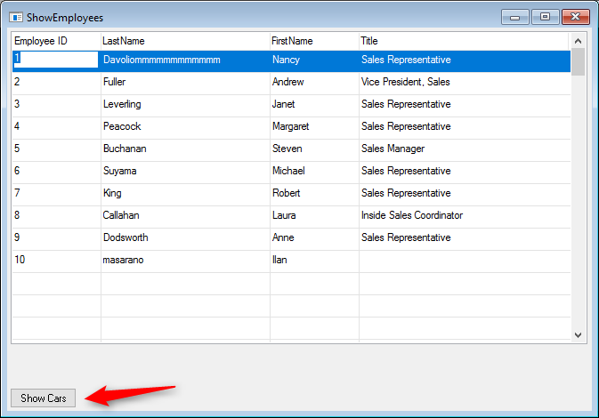

# Exercise - Send Parameter result

The **ShowEmployees** class should look like :
```csdiff
+using System;
+using System.Collections.Generic;
+using System.Text;
+using System.Drawing;
+using Firefly.Box;
+using ENV;
+using ENV.Data;
+
+namespace Northwind.Exercises
+{
+    public class ShowEmployees : UIControllerBase
+    {
+
+        public readonly Models.Employees Employees = new Models.Employees();
+
+        public ShowEmployees()
+        {
+            From = Employees;
+        }
+
+        public void Run()
+        {
+            Execute();
+        }
+
+        protected override void OnLoad()
+        {
+            View = () => new Views.ShowEmployeesView(this);
+        }
+    }
+}
```

The run time version should look like :  



The **ShowEmployees** code behind of the form should look like :
```csdiff
using System;
using System.Collections.Generic;
using System.ComponentModel;
using System.Data;
using System.Drawing;
using System.Text;
using System.Windows.Forms;
using Firefly.Box;
using Firefly.Box.UI.Advanced;
using ENV;
using ENV.Data;

namespace Northwind.Exercises.Views
{
    partial class ShowEmployeesView : Shared.Theme.Controls.Form
    {
        ShowEmployees _controller;
        public ShowEmployeesView(ShowEmployees controller)
        {
            _controller = controller;
            InitializeComponent();
        }

+       private void btnShowCars_Click(object sender, ButtonClickEventArgs e)
+       {
+           new ShowEmployeeCars().Run(_controller.Employees.EmployeeID);
+       }
    }
}
```

The **ShowEmployeeCars** class should look like :
```csdiff
using System;
using System.Collections.Generic;
using System.Text;
using System.Drawing;
using Firefly.Box;
using ENV;
using ENV.Data;

namespace Northwind.Exercises
{
    public class ShowEmployeeCars : UIControllerBase
    {

        public readonly Northwind.Models.EmployeeCars EmployeeCars = new Northwind.Models.EmployeeCars();
        public readonly NumberColumn AverageKM = new NumberColumn();
        public ShowEmployeeCars()
        {
            From = EmployeeCars;
            AverageKM.BindValue(() => EmployeeCars.CarKM / (Date.Now.Year - EmployeeCars.CarYear));
        }

-       public void Run()
-       {
-           Execute();
-       }
+       public void Run(Number EmployeeID)
+       {
+           Where.Add(EmployeeCars.EmployeeID.IsEqualTo(EmployeeID));
+           Execute();
+       }

        protected override void OnLoad()
        {
            View = () => new Views.ShowEmployeeCarsView(this);
        }        
    }
}
```
