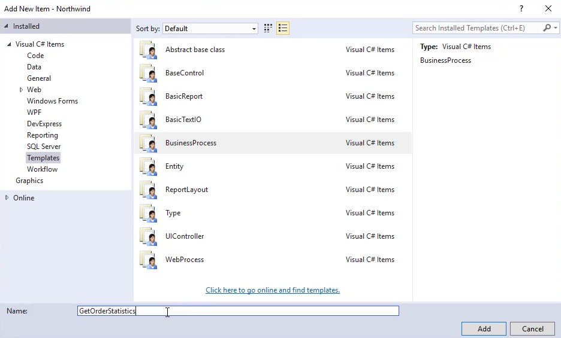
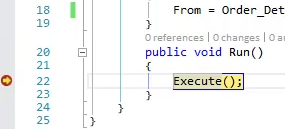
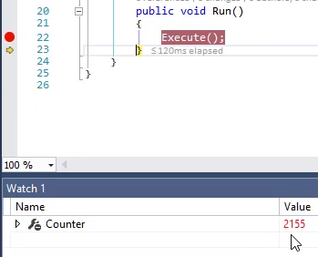

keywords:batch,Lifecycle,life cycle, life-cycle,Break,BreakPoint, Break Point, Watch, Watch Window, Output window
We'll need to automatically iterate the data in the "Order_Details" table. For that we'll use a **BusinessProcess**
* Add a new item, based on the "BusinessProcess" template and call it "GetOrderStatistics"

* Add the Order_Details table to the controller, and set the Controller's `From` Property with that table.

```csdiff
using System;
using System.Collections.Generic;
using System.Text;
using System.Windows.Forms;
using Firefly.Box;
using ENV;
using ENV.Data;
using System.Diagnostics;

namespace Northwind.Training.SimpleScreen
{
    public class GetOrderStatistics : BusinessProcessBase
    {
+       public readonly Models.Order_Details Order_Details = new Models.Order_Details();

        public GetOrderStatistics()
        {
+           From = Order_Details;
        }
        public void Run()
        {
            Execute();
        }
    }
}

```
* Note that you can remove it's `public` modifier, since we'll only use this table inside this controller.
```csdiff
public class GetOrderStatistics : BusinessProcessBase
{
-   public readonly Models.Order_Details Order_Details = new Models.Order_Details();
+   readonly Models.Order_Details Order_Details = new Models.Order_Details();

    public GetOrderStatistics()
    {
        From = Order_Details;
    }
    public void Run()
    {
        Execute();
    }
}
```
* Place a "Break Point" (using the <kbd>F9</kbd> keyboard shortcut) on the call to `Execute` within the `Run` method, and run our controller
* Use the "Controllers" developer tool to run the 'GetOrderStatistics' BusinessProcess
* Visual studio will "Break" into the code and highlight our `Execute` method  

* We'll add the `Counter` property to the "Watch" Window, to see how many rows get's processed  

* We'll then press <kbd>F10</kbd> to "Break" on next line, and we'll see that the value of `Counter` in the "Watch" window change to reflect the number of rows in the Order_Details table.  
