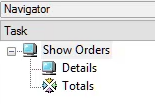
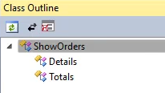
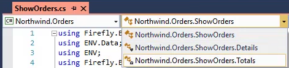

* In Magic you used to have programs, which had many sub tasks
* In the migrated code, these subtasks are migrated to inner classes
### Task tree in magic

### Classes and inner classes in .NET


* These inner classes can be over-viewed using the Classes ComboBox at the top of the screen  

* Or using the "Class Outline" Visual studio extension that you can download from here: [Class Outline Visual Studio Extension](https://marketplace.visualstudio.com/items?itemName=Stickle.ClassOutline)  


### Setting the scene for writing a new inner class
* Create a new UIController called "ShowOrdersToDemoInnerClasses"
* Use the Orders Table
* Add the following local columns to collect the order statistics
* Design the screen so that you'll have some columns on the grid, and the 3 local columns below the grid.
```csdiff
public class ShowOrdersToDemoInnerClasses : UIControllerBase
{

+   public readonly Models.Orders Orders = new Models.Orders();
+   public readonly NumberColumn Items = new NumberColumn("Items", "2");
+   public readonly NumberColumn TotalQuantity = new NumberColumn("Total Quantity", "4");
+   public readonly NumberColumn TotalAmount = new NumberColumn("Total Amount", "5C");
    public ShowOrdersToDemoInnerClasses()
    {
+       From = Orders;
    }
    public void Run()
    {
        Execute();
    }
    protected override void OnLoad()
    {
        View = () => new Views.ShowOrdersToDemoInnerClassesView(this);
    }
}
```
<iframe width="560" height="315" src="https://www.youtube.com/embed/QazBGI0zzW0?list=PL1DEQjXG2xnK8xPqBW89oPL6AHonic9Iz" frameborder="0" allowfullscreen></iframe>

