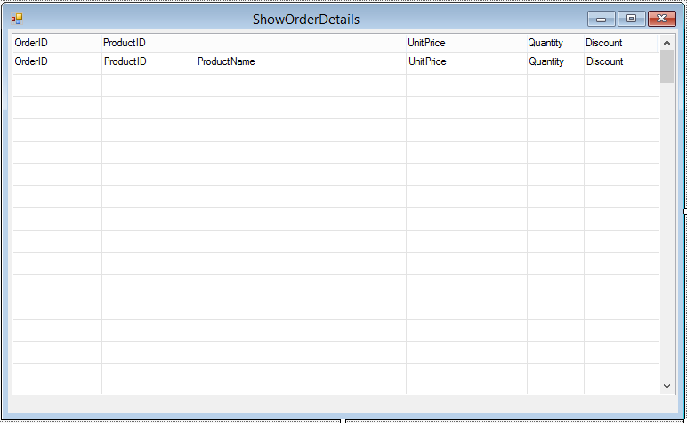

# Exercise - Creating a Simple Screen Result

The **showOrderDetails** class should look like :
```csdiff
using System;
using System.Collections.Generic;
using System.Text;
using System.Drawing;
using Firefly.Box;
using ENV;
using ENV.Data;

namespace Northwind.Exercises
{
    public class ShowOrderDetails : UIControllerBase
    {

+       public readonly Models.Order_Details Order_Details = new Models.Order_Details();
+       public readonly Models.Products Products = new Models.Products();

        public ShowOrderDetails()
        {
+           From = Order_Details;
+           Where.Add(Order_Details.UnitPrice.IsGreaterOrEqualTo(20));
+           OrderBy.Add(Order_Details.OrderID, SortDirection.Descending);
+           Relations.Add(Products, RelationType.Find,
+               Products.ProductsID.IsEqualTo(Products.ProductsID));
        }

        public void Run()
        {
            Execute();
        }

        protected override void OnLoad()
        {
            View = () => new Views.ShowOrderDetailsView(this);
        }
    }
}
```

The **ShowOrderDetails** screen should look like :  

