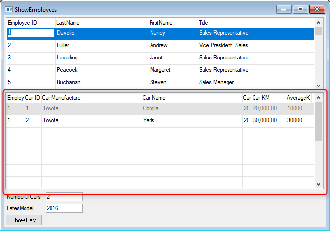

# Exercise - Subform result

Your **ShowEmployees** class should look like :
```csdiff
using System;
using System.Collections.Generic;
using System.Text;
using System.Drawing;
using Firefly.Box;
using ENV;
using ENV.Data;

namespace Northwind.Exercises
{
    public class ShowEmployees : UIControllerBase
    {

        public readonly Models.Employees Employees = new Models.Employees();
        public readonly NumberColumn NumberOfCars = new NumberColumn();
        public readonly NumberColumn LatesModel = new NumberColumn();

 +      public readonly ShowEmployeeCars ShowEmployeeCars = new ShowEmployeeCars();

        public ShowEmployees()
        {
            From = Employees;
        }

        public void Run()
        {
            Execute();
        }

        protected override void OnLoad()
        {
            View = () => new Views.ShowEmployeesView(this);
        }

        protected override void OnEnterRow()
        {
            Cached<GetCarsInfo>().Run();
        }
+       public void RunShowEmployeesCars()
+       {
+           ShowEmployeeCars.Run(Employees.EmployeeID);
+       }
        class GetCarsInfo : BusinessProcessBase
        {
            public readonly Models.EmployeeCars EmployeeCars = new Models.EmployeeCars();

            ShowEmployees _parent;
            public GetCarsInfo(ShowEmployees parent)
            {
                _parent = parent;
                From = EmployeeCars;
                Where.Add(EmployeeCars.EmployeeID.IsEqualTo(_parent.Employees.EmployeeID));
            }
            public void Run()
            {
                _parent.NumberOfCars.Value = 0;
                _parent.LatesModel.Value = 0;
                Execute();
            }
            protected override void OnLoad()
            {

            }
            protected override void OnEnterRow()
            {
                _parent.NumberOfCars.Value++;
                if (EmployeeCars.CarYear > _parent.LatesModel)
                    _parent.LatesModel.Value = EmployeeCars.CarYear;
            }
        }
    }
}
```
Your **ShowEmployeesView** class should look like :
```csdiff
using System;
using System.Collections.Generic;
using System.ComponentModel;
using System.Data;
using System.Drawing;
using System.Text;
using System.Windows.Forms;
using Firefly.Box;
using Firefly.Box.UI.Advanced;
using ENV;
using ENV.Data;

namespace Northwind.Exercises.Views
{
    partial class ShowEmployeesView : Shared.Theme.Controls.Form
    {
        ShowEmployees _controller;
        public ShowEmployeesView(ShowEmployees controller)
        {
            _controller = controller;
            InitializeComponent();
+           subForm1.SetController(_controller.ShowEmployeeCars, _controller.RunShowEmployeesCars);
        }

        private void btnShowCars_Click(object sender, ButtonClickEventArgs e)
        {
            new ShowEmployeeCars().Run(_controller.Employees.EmployeeID);
        }
    }
}
```
Your **ShowEmployeeCars** class should look like :
```csdiff
using System;
using System.Collections.Generic;
using System.Text;
using System.Drawing;
using Firefly.Box;
using ENV;
using ENV.Data;

namespace Northwind.Exercises
{
    public class ShowEmployeeCars : UIControllerBase
    {

        public readonly Northwind.Models.EmployeeCars EmployeeCars = new Northwind.Models.EmployeeCars();
        public readonly NumberColumn AverageKM = new NumberColumn();
        public ShowEmployeeCars()
        {
            From = EmployeeCars;
            AverageKM.BindValue(() => EmployeeCars.CarKM / (Date.Now.Year - EmployeeCars.CarYear));
        }

        public void Run(Number EmployeeID)
        {
+           Where.Clear();
            Where.Add(EmployeeCars.EmployeeID.BindEqualTo(EmployeeID));
            Execute();
        }

        protected override void OnLoad()
        {
            View = () => new Views.ShowEmployeeCarsView(this);
        }        
    }
}
```
The **ShowEmployees** runtime should look like :  
 