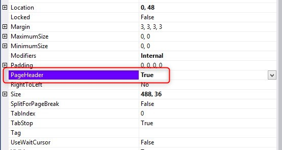
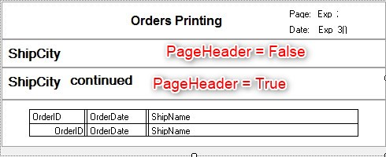
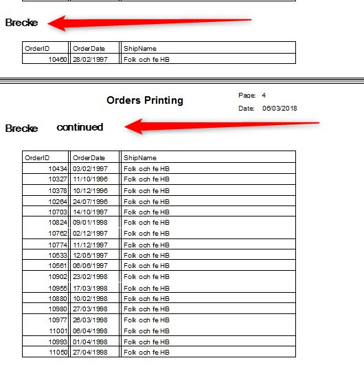

Keywords:batch, businessprocess, report, sections, groups

# Printing group title on a new page

<iframe width="560" height="315" src="https://www.youtube.com/embed/e9S7fhAe1ZQ?list=PL1DEQjXG2xnLss44EgCJq1bAM-Blgf2jd" frameborder="0" allowfullscreen></iframe>

---

In some cases a group might be printed on more than one page - we need to make sure that the group title is printed on every page. In order to do that, all you need to do is set the section *PageHeader* property to true

Whenever a section will be printed in a new page, the report will search upwards for any section which is has the *PageHeader* property set to true and print it as well.

But what if you want to differentiate between the start of the a new group and a group which detail lines are continued to the next page ?
In order to achieve that you can have two sections, one for the *Group Enter* and the other for the *Group Continued* -
both will have the group title, the 2nd one will include a *Continued* indication.  
In this case the 1st one will have the *PageHeader* property set to false (as it is printed explicitly in the *Group Enter*),
and the 2nd one will have the *PageHeader* property set to true.  
  
This will result in a clear distinction between the group start and the group continued:  
