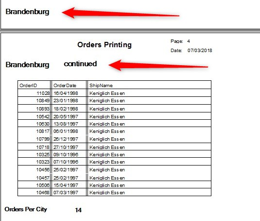
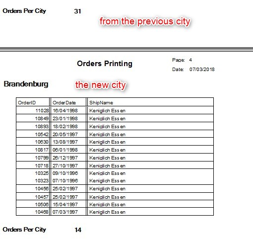

Keywords:batch, businessprocess, report, sections, groups

# Polishing the group footer printing

<iframe width="560" height="315" src="https://www.youtube.com/embed/0er_5obH2Zg?list=PL1DEQjXG2xnLss44EgCJq1bAM-Blgf2jd" frameborder="0" allowfullscreen></iframe>

---

There might be cases in which a group header is printed in one page but the details begins in a new page, because there was not room for the details order.  
For example:  


In order to avoid it you can ask the code to check if there is enough room to print - we need to make sure that both the details and the page footer have enough space.  
In the code it will look like this:
```csdiff
public Print_Orders()
{
    Groups[Orders1.ShipCity].Enter += () =>
    {
+       if (_Printer.HeightUntilEndOfPage < _layout.Body.Height + _layout.GroupLeave.Height)
+           _ioPrint_Order.NewPage();
        _layout.Customer.WriteTo(_Printer);
        OrdersPerCity.Value = 0;
    };

```

And this is the result:  
