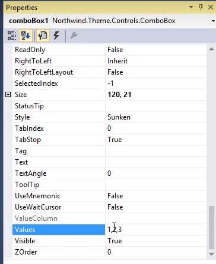

In this section we'll discuss how to use List Controls.

* Create a UIController called "DemoComboBox"
* Add a local NumberColumn called "OurDataInCombo"
* Place a ComboBox on the View, and bind it's data to the local column "OurDataInCombo"
* We can set the values of the Combo Box, by changing the Values propery in the property sheet  
  
or in the control's quick properties  

* If no values are set in the ComboBox's Values property - the attached column's InputRange values will be used as Values
```csdiff
public readonly NumberColumn OurDataInCombo = new NumberColumn
{
+   InputRange = "4,5,6"
}; 
```
* Values that are set in the control's Values property override the values that were set to the Column's InputRange property
* When we want the ComboBox to display values that are different from it's underlying value (descriptions for a code etc... we can use the DisplayValues property
* For example, if we set the Values properties to "1,2,3" and the DisplayValues property to "Noam, Yoni, Eran".
  * When the user selects Noam, the data bound column will have the value of 1.
  * When the user selects Yoni, the data bound column will have the value of 2.
  * When the user selects Eran, the data bound column will have the value of 3.

<iframe width="560" height="315" src="https://www.youtube.com/embed/NXx0C69b6mk?list=PL1DEQjXG2xnIm0e_t85TXwY-Y9r19m-Mz" frameborder="0" allowfullscreen></iframe>