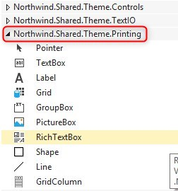

Keywords:batch, businessprocess, report

# Creating a basic report

In this article we will:
* Create our Orders report
* Call the it from the menu

---
<iframe width="560" height="315" src="https://www.youtube.com/embed/kDCO6gfNMV0?list=PL1DEQjXG2xnLss44EgCJq1bAM-Blgf2jd" frameborder="0" allowfullscreen></iframe>

###### To create a new report:
1. In the solution explorer right click on the Folder you would like to add the new report to
2. Select ‘Add’ -> ‘New item’
3. On the left pane select ‘Templates’
4. From the Templates list select BasicReport
5. Give it a meaningful name and press the Add button

Two classes are automatically created:
The Controller class – where the logic is written
The Layout class – the design of the report (the output of the program)
The two classes will be explained in the next session

###### In the controller class:
You will add the logic of the report:
1. What tables are used 
2. What the report actually do (the logic)

###### In the layout class:
You will design the way the report will look.
>When adding controls to the layout make sure you choose from the Printing tab
>