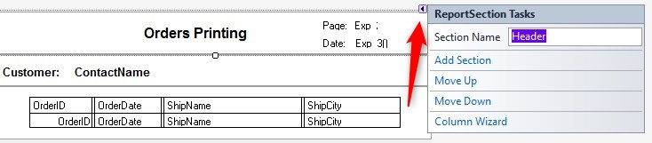

Keywords:batch, businessprocess, report, sections

# Working with report sections

<iframe width="560" height="315" src="https://www.youtube.com/embed/v6vGggwVyUg?list=PL1DEQjXG2xnLss44EgCJq1bAM-Blgf2jd" frameborder="0" allowfullscreen></iframe>

---

#### Adding a report section
When in the layout designer:
1. Click on the existing section - a small arrow will appear in the top-right corner - click it

You can see that you can specify the section's name 
2. Press the *Add Section* and provide it with a meaningful name
3. You can move any section by pressing the *Move Down* or *Move Up*

#### Designing a report section
This is done pretty much like you did so far.
So, for example, you can create two new sections, name them PageHeader and PageFooter.
Then drag the title, page number and date to the PageHeader.

#### Use the added sections in the report controller
In the PrinterWriter , add the *PageHeader* and *PageFooter* properties, indicating the appropriate sections in the layout:
```csdiff
_Printer = new PrinterWriter 
    { 
    PrintPreview = true,
+   PageHeader = _layout.PageHeader,
+   PageFooter = _layout.PageFooter
    };
```