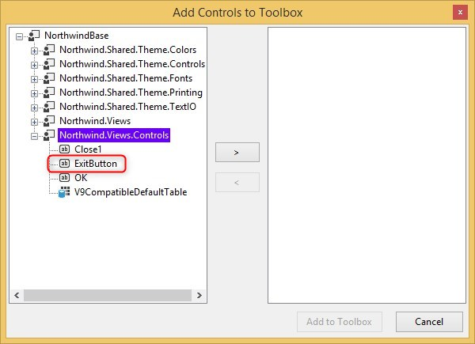

Keywords: Control, model, type, gui

# Creating and using a Control Model

Same as you have controls from the migrated code, you can add controls of your own.  
In order to do that you need to:
1. Go to the Base/Views/Controls folder
2. Right click / add new item and choose the *BaseControl* template
3. Specify a name - for example *ExitButton**
4. The class will be opened in the designer. Press F7 to go to the code
5. Note the type from which your class inherits from - by default it is *TextBox* - you can change it any control from the *Shared.Theme.Controls* namespace. In our sample choose *Button*
6. Setting its properties is done from the designer - so open it (double click on the class) and press F4.  
In our sample you can change the *Format* to display *Exit* and handle its *Click* event to raise the *Command.Exit*
7. Build the *Base* project and then the startup project
8. Now if you will choose the *Add controls to toolbox* option and select the *Base* dll again, you will see the newly added control  

---
<iframe width="560" height="315" src="https://www.youtube.com/embed/uWX025ElpMA?list=PL1DEQjXG2xnKZtXegLpuyGsdaxGh9dr9n" frameborder="0" allowfullscreen></iframe>