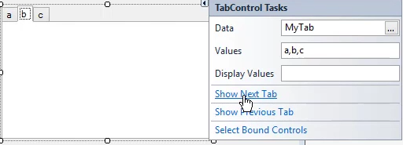
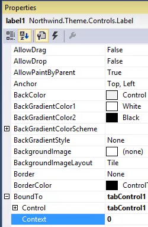

keywords:tabcontrol

* When Binding controls to ListControl we can bind a control to a specific value of that tab control
* This allows us to bind controls that are not necessarily on the Tab Control, to a specific Tab.
* We can use this method to display a control across many tabs.

### Demo
* Add a new UIController called DemoTabControl
* We'll add a local `TextColumn` called "MyTab"
* We'll add a TabControl to the View and Bind it's data to the `MyTab` column
* We'll set the `Values` property to "A, B, C" to create 3 tabs
* We can use the "Show Next Tab" and "Show Previous Tab" to navigate through the different Tabs.  

* We'll change the TabControl's `Style` property to `Flat`
* We'll use the "Send To Back" button to send the TabControl to back
* We'll add a new label with the text "Bind to A", and use the `BoundTo` property to bind it to the TabControl and set it's `Context` to 0 - meaning the first tab.  

* We can switch back and forth between the tabs using the "Show Next Tab" option, and see how the label disappears when a different Tab is selected
* Add another label, called "Label on B" and place it on the tab's border so it exceeds the tab's border
* We'll use the `BoundTo` property to bind it to the TabControl and set it's `Context` to 1, meaning the second tab.
* Add another label, called "Label outside the tab" and place it outside the tab
* We'll use the `BoundTo` property to bind it to the TabControl and set it's `Context` to 2, meaning the third tab.
* Add another label, called "Label that appears on all tabs" and place it in the tab
* Because we don't bind it to any specific context of the tab, it'll appear on all tabs.

*This `Context` setting can be set for any ListControl, including TabContorl, ListBox and ComboBox*

 
<iframe width="560" height="315" src="https://www.youtube.com/embed/DGUCy33wYgQ?list=PL1DEQjXG2xnJAj9_s5itTMM-n7zpLKEnC" frameborder="0" allowfullscreen></iframe>