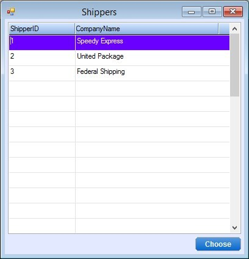

Keywords: online, uicontroller, selection, select, zoom, expand

# Using the generic SelectionList utility

<iframe width="560" height="315" src="https://www.youtube.com/embed/AOqflTS4fWQ?list=PL1DEQjXG2xnKzD8ASzFC1KFYHRQKVk2nC" frameborder="0" allowfullscreen></iframe>

---

Creating a selection list controller for every time it is required can sometimes be tidious / monotonous.  
So we have created a useful utility in the *ENV.Utilities* namespace called **SelectionList**.

In order to use it you need to:
1. Remove the previous call to the SelectShippers controller in the *_Expand* method in the code behind the view
2. Define a variable for the Shippers entity
3. Call the *Show* method of the *SelectionList* utility, sending it 4 parameters:
* The column from the controller, in this case the *Orders.ShipVia*
* The *Shippers* entity variable
* The code column, *ShipperID*
* The description column, *CompanyName*

The code will look like this:
```csdiff
private void txtShipVia_Expand()
{
-    new SelectShippers().Run(_controller.Shippers.ShipperID);
+    var Shippers = new Models.Shippers();
+    ENV.Utilities.SelectionList.Show(_controller.Orders.ShipVia, Shippers, Shippers.ShipperID, Shippers.CompanyName);
}
```

This is the result:  


