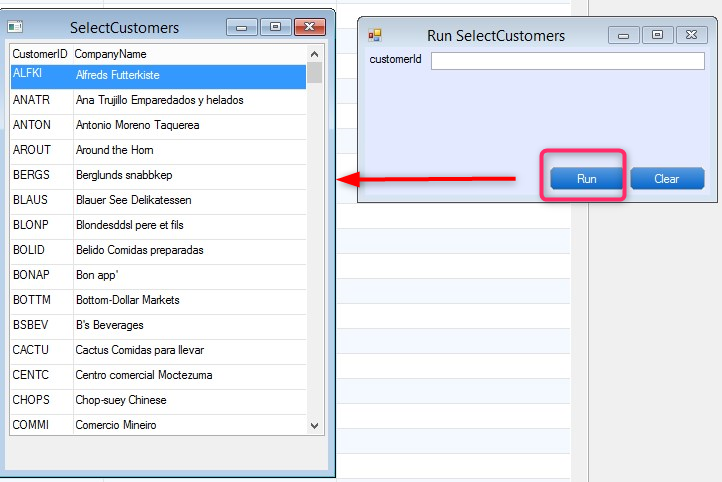
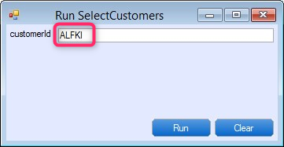

# Exercise - Returning The Selected Value result

Your **SelectCustomers** class should look like :

```csdiff
using System;
using System.Collections.Generic;
using System.Text;
using System.Drawing;
using Firefly.Box;
using ENV;
using ENV.Data;
using System.Diagnostics;

namespace Northwind.Exercises.SelectionList
{
    public class SelectCustomers : UIControllerBase
    {

        public readonly Models.Customers Customers = new Models.Customers();
+       internal TextColumn _CustomerID = new TextColumn();

        public SelectCustomers()
        {
            From = Customers;
        }

+       public void Run(TextColumn customerId)
        {
+           _CustomerID = customerId;
            Execute();
        }

        protected override void OnLoad()
        {
            Activity = Activities.Browse;
            AllowDelete = false;
            AllowInsert = false;
            AllowUpdate = false;
            AllowSelect = true;
            View = () => new Views.SelectCustomersView(this);
        }
        protected override void OnSavingRow()
        {
-            Debug.WriteLine("Selecting Customer ID" + Customers.CustomerID);
+            _CustomerID.Value = Customers.CustomerID;
        }
    }
}
```

The test :



The Result

