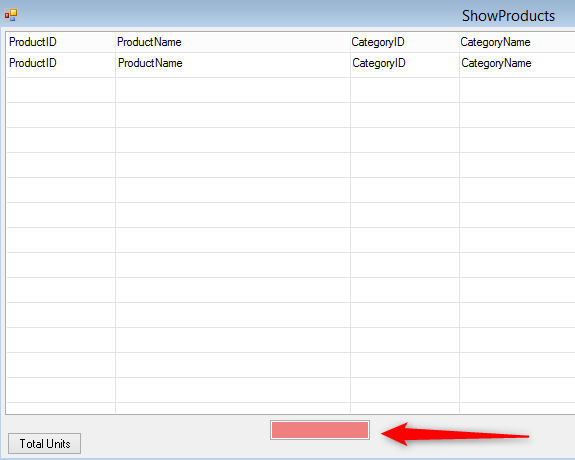

# Exercise - Binding Controls result

At item **5** Your **MandatoryTextBox** code behind should look like :
```csdiff
using System.Drawing;
using Firefly.Box.UI;
using Firefly.Box;
using ENV;
using ENV.Data;

namespace Northwind.Shared.Theme.Controls
{

    /// <summary>MandatoryTextBox</summary>
    public partial class MandatoryTextBox : Shared.Theme.Controls.TextBox
    {


        /// <summary>MandatoryTextBox</summary>
        public MandatoryTextBox()
        {
            InitializeComponent();
        }

+       private void MandatoryTextBox_InputValidation()
+       {
+           if (this.Text == "")
+               ENV.Message.ShowError("This a mandatory text box, it cannot be left empty");
+       }
    }
}
```
items 9 to 16 should look like :  
9 :  
  
  
10 :  
   
11 :  
  
12 :  
  
13:  
  
14 :  
  
  
15 :  

16 :  
 