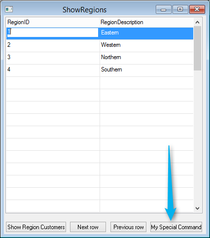

# Exercise - CustomCommand result

Your **ShowRegions** class should look like :
```csdiff
using System;
using System.Collections.Generic;
using System.Text;
using System.Drawing;
using Firefly.Box;
using ENV;
using ENV.Data;

namespace Northwind.TestExercies
{
    public class ShowRegions : UIControllerBase
    {
+       public readonly CustomCommand MySpecialCommand = new CustomCommand()
+       {
+           Precondition = CustomCommandPrecondition.LeaveRow
+       }; 
        public readonly Models.Region Region = new Models.Region();

        public ShowRegions()
        {
            From = Region;
            Handlers.Add(System.Windows.Forms.Keys.F9,HandlerScope.CurrentTaskOnly).Invokes += e =>
            {
                System.Windows.Forms.MessageBox.Show("I am handling the F9 keyboard event!");
            };
            Handlers.Add(System.Windows.Forms.Keys.F10).Invokes += e =>
            {
                System.Windows.Forms.MessageBox.Show("I am handling the F10 keyboard event!");
            };
            Handlers.Add(System.Windows.Forms.Keys.F5, HandlerScope.CurrentTaskOnly).Invokes += e =>
            {
                Create<Customers.Exercises.IShowCustomerPerRegion>().Run(Region.RegionID);
                e.Handled = true;
            };

            var hF5 = Handlers.Add(System.Windows.Forms.Keys.F5, HandlerScope.CurrentTaskOnly);
            hF5.Invokes += e =>
            {
                Create<Customers.Exercises.IShowCustomerPerRegion>().Run(Region.RegionID);
                e.Handled = true;
            };
            hF5.BindEnabled(() => Region.RegionID == 1);

            Handlers.Add(Command.UndoChangesInRow, HandlerScope.CurrentTaskOnly).Invokes += e =>
            {
                e.Handled = Common.ShowYesNoMessageBox("Undo","Are you sure you want to undo current row changes",false);
            };
+           Handlers.Add(MySpecialCommand, HandlerScope.CurrentTaskOnly).Invokes += e =>
+           {
+               System.Windows.Forms.MessageBox.Show("My Special Command Handler");
+               e.Handled = true;
+           };
        }

        public void Run()
        {
            Execute();
        }

        protected override void OnLoad()
        {
            View = () => new Views.ShowRegionsView(this);
        }
+       protected override void OnStart()
+       {
+           Raise(MySpecialCommand);
+       }
+       protected override void OnLeaveRow()
+       {
+           System.Windows.Forms.MessageBox.Show("OnLeaveRow");
+       }
    }
}
```
Your **ShowRegions** class should look like :
```csdiff
using System;
using System.Collections.Generic;
using System.ComponentModel;
using System.Data;
using System.Drawing;
using System.Text;
using System.Windows.Forms;
using Firefly.Box;
using Firefly.Box.UI.Advanced;
using ENV;
using ENV.Data;

namespace Northwind.TestExercies.Views
{
    partial class ShowRegionsView : Shared.Theme.Controls.Form
    {
        ShowRegions _controller;
        public ShowRegionsView(ShowRegions controller)
        {
            _controller = controller;
            InitializeComponent();
        }

        private void button1_Click(object sender, ButtonClickEventArgs e)
        {
            Create<Customers.Exercises.IShowCustomerPerRegion>().Run(_controller.Region.RegionID);
        }

        private void button2_Click(object sender, ButtonClickEventArgs e)
        {
            e.Raise(Command.GoToNextRow);
        }

        private void button3_Click(object sender, ButtonClickEventArgs e)
        {
            e.Raise(Command.GoToPreviousRow);
        }

+       private void button4_Click(object sender, ButtonClickEventArgs e)
+       {
+           e.Raise(_controller.MySpecialCommand);
+       }
    }
}
```
The **ShowRegions** runtime should look like :  

