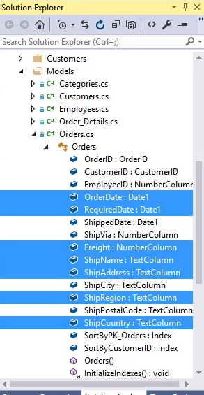

* Select multiple columns in the Solution Explorer

* Drag them to the code, and before you drop, click the <kbd>Shift</kbd> key
* The Columns Will be Automatically added to your code
```csdiff
    public class DemoColumnsCollection : UIControllerBase
    {
        public readonly Models.Orders Orders = new Models.Orders();
        public readonly Models.Customers Customers = new Models.Customers();
        public readonly DateColumn EndOfMonth = new DateColumn("EndOfMonth");
        public DemoColumnsCollection()
        {
            From = Orders;
            Relations.Add(Customers, Customers.CustomerID.IsEqualTo(Orders.CustomerID));

             Columns.Add(Orders.OrderID);
             Columns.Add(Orders.CustomerID);
+            Columns.Add(Orders.OrderDate);
+            Columns.Add(Orders.RequiredDate);
+            Columns.Add(Orders.Freight);
+            Columns.Add(Orders.ShipName);
+            Columns.Add(Orders.ShipAddress);
+            Columns.Add(Orders.ShipRegion);
+            Columns.Add(Orders.Ship Country);
        }
        public void Run()
        {
            Execute();
        }
        protected override void OnLoad()
        {
            View = () => new Views.DemoColumnsCollectionView(this);
        }
    }
```
<iframe width="560" height="315" src="https://www.youtube.com/embed/4Ao3rf2M8cU?list=PL1DEQjXG2xnLhBFafjdkhUD_rDsiXiXHr" frameborder="0" allowfullscreen></iframe>


