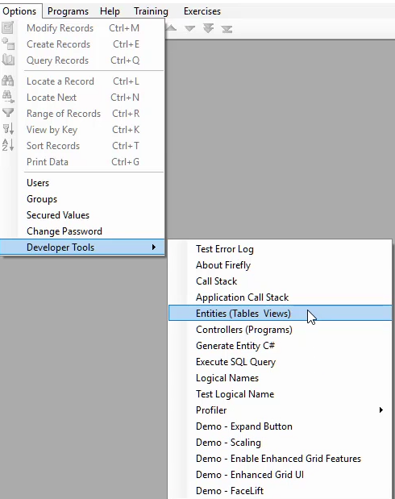

* We can access the "Entities" developer too using the "Options\Developer Tools\Entities (Tables View)" menu entry.

* We can also right click on the status bar and choose "Developer Tools\Entities (Tables View)" menu entry.
* We can use the <kbd>Shift</kbd> + <kbd>F2</kbd> keyboard shortcut

<iframe width="560" height="315" src="https://www.youtube.com/embed/CQB9CuAjzjM?list=PL1DEQjXG2xnItyh3tX-1kfE3K50w48PNA" frameborder="0" allowfullscreen></iframe>

