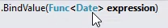

keywords: Init Expression
* We want that whenever the user changes the value for the `FromDate` column, the value of the `ToDate` column will automatically recompute to the "End of Month" of the date in the `FromDate` column
* Review the second overload of the `BindValue` method.  

* Func`<Date>` means a method that return `Date`
* see [Func Power Point Presentation](Func.pptx)
```csdiff
public class DemoLocalColumns : UIControllerBase
{
    public readonly DateColumn FromDate = new DateColumn("From Date");
    public readonly DateColumn ToDate = new DateColumn("To Date");
    public readonly NumberColumn DaysBetween = new NumberColumn("Days Between","5CN");

    public DemoLocalColumns()
    {
+       ToDate.BindValue(GetEndOfMonthOfFromDate);
    }
+   public Date GetEndOfMonthOfFromDate()
+   {
+       return FromDate.EndOfMonth;
+   }
  ...
}
```
* Note that we are sending the method `GetEndOfMonthOfFromDate` as a parameter to the `BindValue` method without parenthesis 
* Use `Debug.WriteLine` to demonstrate that the `GetEndOfMonthOfFromDate` method calculates whenever we change the `FromDate` column
<iframe width="560" height="315" src="https://www.youtube.com/embed/ccBHKtwOTtM?list=PL1DEQjXG2xnKHKNIRzI4K6oZL-KulU-Vw" frameborder="0" allowfullscreen></iframe>

For a deeper discussion of these topics see [Lambda Expressions Generics and BindValue](lambda-expressions-generics-and-bindvalue.html)