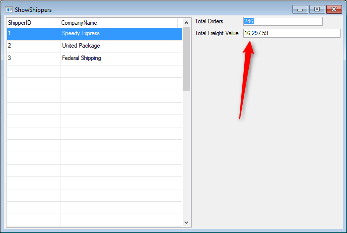

# Exercise - In Out and Call result

The **CalcOrderTotalForShipper** class should look like :
```csdiff
using System;
using System.Collections.Generic;
using System.Text;
using System.Windows.Forms;
using Firefly.Box;
using ENV;
using ENV.Data;
using System.Diagnostics;

namespace Northwind.Exercises
{
    public class CalcOrderTotalForShipper : BusinessProcessBase
    {
        public readonly Models.Orders Orders = new Models.Orders();
        Number _numberOfOrders = 0;
        Number _totalValue = 0;

        public CalcOrderTotalForShipper()
        {
            From = Orders;
        }
-       public void Run(Number pShipperID)
+       public void Run(Number pShipperID,NumberColumn pTotalOrders, NumberColumn pTotalFreightValue)
        {
            Where.Add(Orders.ShipVia.IsEqualTo(pShipperID));
            Execute();
+           pTotalOrders.Value = _numberOfOrders;
+           pTotalFreightValue.Value = _totalValue;
        }
        protected override void OnLeaveRow()
        {
            _numberOfOrders++;
            _totalValue += Orders.Freight;
            Debug.WriteLine("OrderID :" + Orders.OrderID + " Shipper ID :" + Orders.ShipVia);
            Debug.WriteLine("\t\tNumber of orders : " + _numberOfOrders + " Total value :" + _totalValue);
        }
    }
}
```

The Output  panel results should look like :  

 