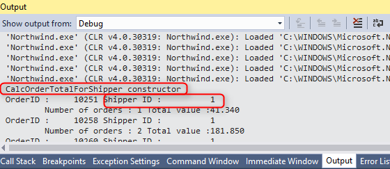

# Exercise - Cached result

The **CalcOrderTotalForShipper** class should look like :
```csdiff
using System;
using System.Collections.Generic;
using System.Text;
using System.Windows.Forms;
using Firefly.Box;
using ENV;
using ENV.Data;
using System.Diagnostics;

namespace Northwind.Exercises
{
    public class CalcOrderTotalForShipper : BusinessProcessBase
    {
        public readonly Models.Orders Orders = new Models.Orders();
        Number _numberOfOrders = 0;
        Number _totalValue = 0;

        public CalcOrderTotalForShipper()
        {
            From = Orders;
+           Debug.WriteLine("CalcOrderTotalForShipper constructor");
        }
        public void Run(Number pShipperID,NumberColumn pTotalOrders, NumberColumn pTotalFreightValue)
        {
            Where.Add(Orders.ShipVia.IsEqualTo(pShipperID));
            Execute();
            pTotalOrders.Value = _numberOfOrders;
            pTotalFreightValue.Value = _totalValue;
        }
        protected override void OnLeaveRow()
        {
            _numberOfOrders++;
            _totalValue += Orders.Freight;
            Debug.WriteLine("OrderID :" + Orders.OrderID + " Shipper ID :" + Orders.ShipVia);
            Debug.WriteLine("\t\tNumber of orders : " + _numberOfOrders + " Total value :" + _totalValue);
        }
    }
}
```

The Output  panel results should look like :  

 

The **ShowShippers** class should look like :
```csdiff
using System;
using System.Collections.Generic;
using System.Text;
using System.Drawing;
using Firefly.Box;
using ENV;
using ENV.Data;

namespace Northwind.Exercises
{
    public class ShowShippers : UIControllerBase
    {

        public readonly Models.Shippers Shippers = new Models.Shippers();
        public readonly NumberColumn TotalOrders = new NumberColumn("Total Orders","6");
        public readonly NumberColumn TotalFreightValue = new NumberColumn("Total Freight Value", "6.2C");

        public ShowShippers()
        {
            From = Shippers;
        }

        public void Run()
        {
            Execute();
        }

        protected override void OnLoad()
        {
            View = () => new Views.ShowShippersView(this);
        }
        protected override void OnEnterRow()
        {
-           new CalcOrderTotalForShipper().Run(Shippers.ShipperID,TotalOrders,TotalFreightValue);
+           Cached<CalcOrderTotalForShipper>().Run(Shippers.ShipperID, TotalOrders, TotalFreightValue);
        }
    }
}
```

After item 5 in the Exercise :

The **CalcOrderTotalForShipper** class should look like :
```csdiff
using System;
using System.Collections.Generic;
using System.Text;
using System.Windows.Forms;
using Firefly.Box;
using ENV;
using ENV.Data;
using System.Diagnostics;

namespace Northwind.Exercises
{
    public class CalcOrderTotalForShipper : BusinessProcessBase
    {
        public readonly Models.Orders Orders = new Models.Orders();
        Number _numberOfOrders = 0;
        Number _totalValue = 0;

        public CalcOrderTotalForShipper()
        {
            From = Orders;
            Debug.WriteLine("CalcOrderTotalForShipper constructor");
        }
        public void Run(Number pShipperID,NumberColumn pTotalOrders, NumberColumn pTotalFreightValue)
        {
+           Where.Clear();
+           _numberOfOrders = 0;
+           _totalValue = 0;
            Where.Add(Orders.ShipVia.IsEqualTo(pShipperID));
            Execute();
            pTotalOrders.Value = _numberOfOrders;
            pTotalFreightValue.Value = _totalValue;
        }
        protected override void OnLeaveRow()
        {
            _numberOfOrders++;
            _totalValue += Orders.Freight;
            Debug.WriteLine("OrderID :" + Orders.OrderID + " Shipper ID :" + Orders.ShipVia);
            Debug.WriteLine("\t\tNumber of orders : " + _numberOfOrders + " Total value :" + _totalValue);
        }
    }
}
```